## (1) Stage A: Training (Exclusively Healthy Brains) -> Training

The model stores as static memory: the dictionaries of normal prototypes $\mathcal{S}\_{Normal}$; the spectral bases $\{|u\_i\rangle, |w^y\_j\rangle\}$; the reference distributions of $\eta\_y$ and $\sigma\_{Macro}$; and the empirical thresholds $\tau\_y$ derived from the 95th percentile of the healthy projection distribution.

```mermaid
---
config:
  layout: elk
---
flowchart LR
 subgraph P2D ["⬛ PHASE I (Intra-Plane 2D: Independent Execution z)"]
 subgraph L0["Layer 0: Constrained Ingestion"]
        A["Cartesian Plane z extractive"]
        B("Rigorous Spatial Sectorization r > r_min")
        C["Individual Packets c_{k,m} ∈ ℝ^Q"]
        C2["|V_m⟩_z ∈ ℝ^(N'×Q) [Eq. 1b]"]
  end
 subgraph L1["Layer 1: Metric Spectral Bifurcation"]
        D{"Ĉ_z ⟨V_m|V_m'⟩_J [Eq. 3]"}
        E["Diagonalization M×M [Eq. 4]"]
        F["Ĉ_Macro [Eq. 5]"]
        G["Ĉ_Micro [Eq. 6]"]
        H(("OPF Macro Normal"))
        I["C_Macro(m,z)"]
        SIG["σ_Macro (Sentinel)"]
  end
 subgraph L2["Layer 2: 5 Operator Tensors"]
        Op_O("Ô Intensity [8a]")
        Op_S("Ŝ Symmetry [8b]")
        Op_chi("χ̂ Chirality [8c]")
        Op_Dr("D̂_r Radial Divergence [8d]")
        Op_R("R̂ Reciprocal (FFT) [8e]")
        K_O["Purif. C_O + η_O (Eq. 12)"]
        K_S["Purif. C_S + η_S"]
        K_chi["Purif. C_χ + η_χ"]
        K_Dr["Purif. C_Dr + η_Dr"]
        K_R["Purif. C_R + η_R"]
        M_O(("OPF_O PDF ρ_O"))
        M_S(("OPF_S PDF ρ_S"))
        M_chi(("OPF_χ PDF ρ_χ"))
        M_Dr(("OPF_Dr PDF ρ_Dr"))
        M_R(("OPF_R PDF ρ_R"))
        N_O["C_O^corr (Eq. 16)"]
        N_S["C_S^corr"]
        N_chi["C_χ^corr"]
        N_Dr["C_Dr^corr"]
        N_R["C_R^corr"]
  end
 subgraph L2b["Precursor Identities"]
        ID_O["|A_O⟩"]
        ID_S["|A_S⟩"]
        ID_chi["|A_χ⟩"]
        ID_Dr["|A_Dr⟩"]
        ID_R["|A_R⟩"]
  end
 end
 subgraph CONTROLE ["⬛ OUTER LOOP (Individual Brain n Control)"]
        N_IN{{"Input: Brain n ∈ N_train"}}
        BUFFER[("VOLUMETRIC BUFFER: Agglutination of Z_max Slices")]
 end
 subgraph P3D ["⬛ PHASE II/III (3D Volumetric Composition)"]
 subgraph L3["Layer 3: Volumetric Fusion and Decision"]
        O_node{"Tensorial Concatenation"}
        P["T_meta(m,z) ∈ ℝ¹² [Eq. 17]"]
        Q["D̂_z [Eq. 18]"]
        R{"Global 3D Graph G_3D"}
        S("Projection P_Y (Eq. 21)")
        T(("OPF Volumetric f_max"))
        U["W_opt(m,z) [Eq. 19]"]
  end
 subgraph Render["Diagnostic Output"]
        V["RBF 3D Render (Eq. 22)"]
        W[["Clinical XAI Map"]]
        X[["Clinical Alert: σ_Macro Outside Domain"]]
  end
 end
    N_IN -- "Iteration: Extract Slice z" --> A
    A --> B --> C --> C2 --> D --> E
    E -- Dominant Modes K --> F
    E -- Residual Modes --> G
    F --> H --> I
    C2 -- "Reconstruction Residue" --> SIG
    F --> SIG
    G -- Projection Eq.7 --> Op_O & Op_S & Op_chi & Op_Dr & Op_R
    Op_O --> K_O --> M_O --> N_O
    Op_S --> K_S --> M_S --> N_S
    Op_chi --> K_chi --> M_chi --> N_chi
    Op_Dr --> K_Dr --> M_Dr --> N_Dr
    Op_R --> K_R --> M_R --> N_R
    K_O -. Dominant Mode w¹_O .-> ID_O
    K_S -. Dominant Mode w¹_S .-> ID_S
    K_chi -. Dominant Mode w¹_χ .-> ID_chi
    K_Dr -. Dominant Mode w¹_Dr .-> ID_Dr
    K_R -. Dominant Mode w¹_R .-> ID_R
    I --> O_node
    SIG --> O_node
    N_O --> O_node
    N_S --> O_node
    N_chi --> O_node
    N_Dr --> O_node
    N_R --> O_node
    K_O -. η_O .-> O_node
    K_S -. η_S .-> O_node
    K_chi -. η_χ .-> O_node
    K_Dr -. η_Dr .-> O_node
    K_R -. η_R .-> O_node
    O_node --> P
    P -- "Agglutinate in RAM" --> BUFFER
    BUFFER -- "Condition: Loop Z Exhausted" --> Q
    BUFFER --> R
    Q --> R
    ID_O & ID_S & ID_chi & ID_Dr & ID_R -. Precursor Projections .-> S
    S -. Precursor Roots C=0 .-> R
    R --> T
    T --> U
    U --> V
    V --> W
    SIG -. Domain Alert .-> X

     A:::input
     B:::input
     C:::input
     C2:::input
     D:::macro
     E:::macro
     F:::macro
     G:::micro
     H:::opf
     I:::opf
     SIG:::sentinel
     Op_O:::micro
     Op_S:::micro
     Op_chi:::micro
     Op_Dr:::micro
     Op_R:::micro
     K_O:::micro
     K_S:::micro
     K_chi:::micro
     K_Dr:::micro
     K_R:::micro
     M_O:::opf
     M_S:::opf
     M_chi:::opf
     M_Dr:::opf
     M_R:::opf
     N_O:::opf
     N_S:::opf
     N_chi:::opf
     N_Dr:::opf
     N_R:::opf
     ID_O:::identity
     ID_S:::identity
     ID_chi:::identity
     ID_Dr:::identity
     ID_R:::identity
     O_node:::fusion
     P:::fusion
     Q:::fusion
     R:::fusion
     S:::fusion
     T:::opf
     U:::output
     V:::output
     W:::output
     X:::sentinel
     N_IN:::loop
     BUFFER:::database
    class P2D,P3D,CONTROLE dashed_box
    classDef dashed_box fill:transparent,stroke:#9e9e9e,stroke-width:2px,stroke-dasharray: 5 5
    classDef loop fill:#ffecb3,stroke:#ff8f00,stroke-width:3px,stroke-dasharray: 5 5
    classDef database fill:#b3e5fc,stroke:#0277bd,stroke-width:3px
    classDef input fill:#e1f5fe,stroke:#311b92,stroke-width:2px
    classDef macro fill:#e8f5e9,stroke:#1b5e20,stroke-width:2px
    classDef micro fill:#fff3e0,stroke:#e65100,stroke-width:2px
    classDef opf fill:#f3e5f5,stroke:#4a148c,stroke-width:2px,stroke-dasharray: 5 5
    classDef fusion fill:#ffebee,stroke:#b71c1c,stroke-width:2px
    classDef identity fill:#e8eaf6,stroke:#283593,stroke-width:2px
    classDef sentinel fill:#fce4ec,stroke:#c62828,stroke-width:3px,stroke-dasharray: 3 3
    classDef output fill:#212121,color:#fff,stroke:#ffeb3b,stroke-width:3px
```

## (2) Stage C: Clinical Inference (Patient $N+1$) -> Inference

The volumetric exam of the new patient (Volume $N+1$) enters via the control loop and is vectorized iteratively slice by slice to be evaluated against the static memory of the model.

```mermaid
---
config:
  layout: elk
---
flowchart LR
 subgraph P2D_C ["⬛ 2D SENSORIAL EXTRACTION (Per Isolated Slice)"]
 subgraph Memoria["Static Memory of the Trained Model"]
        S_N["S_Normal: Normative Prototypes"]
        S_P["S_precursor: T0 Precursor Prototypes"]
        Bases["Spectral Bases C_y and Gram Metrics"]
        Ref["Reference Thresholds: η_y and σ_Macro populations"]
  end
 subgraph Paciente["Test Patient N+1"]
        MRI["Raw MRI Exam"]
        V_new["|V_m⟩_z Tensorized"]
        Proj["Projection onto Subspace of Learned Bases"]
        Ops_new["Action of the 5 Operator Tensors"]
        OPF_intra(("6 Intra-Plane OPF Graphs (1 Macro + 5 Micro)"))
        T_new["T_meta ∈ ℝ¹² Assembled Locally"]
        D_new["D̂_z: Slice Differential"]
  end
 end
 subgraph CONTROLE_C ["⬛ CLINICAL LOOP: Agglutination Patient N+1"]
        PAC_IN{{"Cyclic Input: Volume N+1"}}
        BUF_PAC[("TRANSIENT BUFFER: Saturation of Z_max Slices")]
 end
 subgraph P3D_C ["⬛ 3D VOLUMETRIC INTEGRATION (Longitudinal Continuum)"]
 subgraph Competicao["Volumetric OPF Competition (IFT-3D)"]
        G3D{"Graph G_3D w/ Patient Nodes [ℝ²⁴]"}
        Init["Disjoint Initialization: C_{S_Normal}=0, C_{S_precursor}=0, Nodes=+∞"]
        Fila["Priority Queue in Heap Q"]
        Comp["Inferential Loop: s = argmin Q"]
        Oferta["Adjacency t: c_tmp = max(C_s, d(s,t))"]
        Teste{"c_tmp &lt; C_t?"}
        Atualiza["C_t ← c_tmp, L_t ← L_s"]
        Resultado["Bifurcated Volumetric Forest"]
  end
 subgraph Saida["Diagnostic Result"]
        W_out["W_opt(m,z): Optimal Path Cost"]
        Class["L_(m,z): Normal or Precursor State"]
        Render["Gaussian XAI Renderization Eq. 22"]
        Alerta{"σ_Macro > 95th Percentile Training?"}
        OK[["Diagnostic XAI Report"]]
        ATTN[["Alert: Case Outside Projected Domain"]]
  end
 end
    PAC_IN -- "Iterate Slice z" --> MRI
    MRI --> V_new
    Bases --> Proj
    V_new --> Proj
    Proj --> Ops_new
    Ops_new --> OPF_intra
    OPF_intra --> T_new
    T_new -- "Agglutinate in RAM" --> BUF_PAC
    BUF_PAC -- "Condition: Loop Z Complete" --> D_new
    BUF_PAC --> G3D
    D_new --> G3D
    S_N -- Healthy Prototypes --> G3D
    S_P -- Precursor Prototypes --> G3D
    G3D --> Init
    Init --> Fila
    Fila --> Comp
    Comp --> Oferta
    Oferta --> Teste
    Teste -- Accepted --> Atualiza
    Atualiza --> Comp
    Teste -- Rejected --> Comp
    Comp -- Queue Q Exhausted --> Resultado
    Resultado --> W_out & Class
    W_out --> Render
    Ref --> Alerta
    Render --> Alerta
    Alerta -- Controlled Cost --> OK
    Alerta -- Macroscopic Anomaly Detected --> ATTN

     S_N:::normal
     S_P:::precursor
     Bases:::memoria
     Ref:::memoria
     MRI:::paciente
     V_new:::paciente
     Proj:::paciente
     Ops_new:::paciente
     T_new:::paciente
     OPF_intra:::opf_intra
     D_new:::paciente
     G3D:::competicao_node
     Init:::competicao_node
     Fila:::competicao_node
     Comp:::competicao_node
     Oferta:::competicao_node
     Teste:::competicao_node
     Atualiza:::competicao_node
     Resultado:::competicao_node
     W_out:::saida_node
     Class:::saida_node
     Render:::saida_node
     Alerta:::sentinel
     OK:::output
     ATTN:::sentinel
     PAC_IN:::loop
     BUF_PAC:::database
    class P2D_C,P3D_C,CONTROLE_C dashed_box
    classDef dashed_box fill:transparent,stroke:#9e9e9e,stroke-width:2px,stroke-dasharray: 5 5
    classDef loop fill:#ffecb3,stroke:#ff8f00,stroke-width:3px,stroke-dasharray: 5 5
    classDef database fill:#b3e5fc,stroke:#0277bd,stroke-width:3px
    classDef paciente fill:#e3f2fd,stroke:#1565c0,stroke-width:2px
    classDef normal fill:#e8f5e9,stroke:#2e7d32,stroke-width:2px
    classDef precursor fill:#fff3e0,stroke:#e65100,stroke-width:2px
    classDef memoria fill:#f3e5f5,stroke:#6a1b9a,stroke-width:2px
    classDef opf_intra fill:#f3e5f5,stroke:#4a148c,stroke-width:2px,stroke-dasharray: 5 5
    classDef competicao_node fill:#fce4ec,stroke:#c62828,stroke-width:2px
    classDef sentinel fill:#ffcdd2,stroke:#b71c1c,stroke-width:3px,stroke-dasharray: 3 3
    classDef saida_node fill:#e0e0e0,stroke:#424242,stroke-width:2px
    classDef output fill:#212121,color:#fff,stroke:#ffeb3b,stroke-width:3px
```

## (3) D3. Summary of the Vector Space Composition -> VS-Composition

The following diagram details the complete mechanics of Section 1. The Cartesian input $I(x,y)$ is re-centered at $(x\_0, y\_0)$ (Section D1) and discretized into a polar grid of $M \times N$ positions. The decision branch at **S1** imposes the criterion $r\_k\,\Delta r\,\Delta\theta \ge \Delta x\,\Delta y$: sectors below the threshold (sub-pixel) are excluded, defining $r\_{min}$ and, consequently, $N'$ (the effective number of radial bands). Each active sector $\Omega\_{k,m}$ is affinely mapped to the unit disk at **S2** (preserving orthogonality), where the projection onto the aneular Zernike basis at **S3** extracts $Q$ spectral coefficients: the *piston* mode ($q=1$) captures the DC intensity, the *tilt* modes ($q=2,3$) the directional and transversal gradients, and the *defocus* mode ($q=4$) the local curvature, sensitive to isointense micro-lesions. The $N'$ packets $\mathbf{c}\_{k,m} \in \mathbb{R}^Q$ of a ray $\theta\_m$ are stacked and normalized at **S4**, producing the state $|\mathbf{V}\_m\rangle\_z \in \mathbb{R}^{N' \times Q}$. The Jacobian metric at **S5** weights each band by $r\_k$, correcting the bias that would over-represent central tissue at the expense of the peripheral cortex.

```mermaid
---
config:
  layout: elk
---
flowchart LR
 subgraph PIP_COMP ["⬛ 2D PLANE DOMAIN (Operation Restricted to z)"]
 subgraph S0["Input: Slice z"]
        IMG["I(x,y): Cartesian Intensity"]
        CTR["(x₀,y₀): Symmetry Center [D1]"]
  end
 subgraph S1["Angular and Radial Partition"]
        direction TB
        GRID["Polar Grid: M rays × N radial bands"]
        RMIN{"r_k·Δr·Δθ ≥ Δx·Δy?"}
        EXCL["Exclude Core r < r_min [Eq. rmin]"]
        SECTOR["Active Sector Ω_k,m\n[r_k±Δr/2, θ_m±Δθ/2]"]
        N_EFF["N' = ⌈(R_max - r_min)/Δr⌉"]
  end
 subgraph S2["Affine Mapping → Normalized Disk"]
        direction TB
        RHO["ρ = (r - r_min)/(R_max - r_min) ∈ [0,1]"]
        PHI["φ = (θ - θ_m)/(Δθ/2) ∈ [-1,1]"]
        DISK["Ω_k,m ↦ Unit Disk D"]
  end
 subgraph S3["Projection onto Aneular Zernike Basis"]
        direction TB
        ORTH["⟨Z_n^m, Z_n'^m'⟩ = π/(n+1)·δ_nn'δ_mm'"]
        C1["q=1 (piston): c₁ = ∬ I·Z₀⁰ dxdy\nMean DC intensity"]
        C23["q=2,3 (tilt): gradients ∂_x, ∂_y"]
        C4["q=4 (defocus): local curvature\nIsointense micro-lesions"]
        CQ["c_q = ∬_Ω I·φ_q dxdy, q=1..Q [Eq. 1a]"]
        PACK["c_k,m = [c₁,...,c_Q]ᵀ ∈ ℝ^Q"]
  end
 subgraph S4["Radial Stacking"]
        direction TB
        STACK["Ray θ_m: stack N' packets\n[c_{1,m}, c_{2,m},...,c_{N',m}]"]
        NORM["Normalize: 𝒩 such that ⟨V_m|V_m⟩_J = 1"]
        STATE["|V_m⟩_z ∈ ℝ^(N'×Q) [Eq. 1b]"]
  end
 subgraph S5["Jacobian Metric"]
        direction TB
        JAC["Jacobian: |∂(x,y)/∂(r,θ)| = r_k"]
        PROD["⟨V_m|V_m'⟩_J = Σ_k r_k · c_k,m^T c_k,m' [Eq. 2]"]
        BIAS["Large r_k → high peripheral weight\nSmall r_k → reduced central weight"]
  end
 end
    IMG --> CTR
    CTR --> GRID
    GRID --> RMIN
    RMIN -- "No: sub-pixel" --> EXCL
    RMIN -- "Yes" --> SECTOR
    EXCL --> N_EFF
    N_EFF --> SECTOR
    SECTOR --> RHO & PHI
    RHO & PHI --> DISK
    DISK --> ORTH
    ORTH --> C1 & C23 & C4
    C1 & C23 & C4 --> CQ --> PACK
    PACK --> STACK --> NORM --> STATE
    STATE --> JAC --> PROD
    PROD --> BIAS

     IMG:::entrada
     CTR:::algoritmo
     GRID:::algoritmo
     RMIN:::decisao
     EXCL:::restricao
     SECTOR:::setor
     N_EFF:::restricao
     RHO:::mapeamento
     PHI:::mapeamento
     DISK:::mapeamento
     ORTH:::base
     C1:::modo
     C23:::modo
     C4:::modo
     CQ:::base
     PACK:::base
     STACK:::tensor
     NORM:::tensor
     STATE:::tensor
     JAC:::jacobiano
     PROD:::jacobiano
     BIAS:::jacobiano
    classDef entrada fill:#e3f2fd,stroke:#1565c0,stroke-width:2px
    classDef algoritmo fill:#e8f5e9,stroke:#2e7d32,stroke-width:2px
    classDef decisao fill:#fff9c4,stroke:#f9a825,stroke-width:2px
    classDef restricao fill:#fce4ec,stroke:#c62828,stroke-width:2px
    classDef setor fill:#e8f5e9,stroke:#388e3c,stroke-width:3px
    classDef mapeamento fill:#fff3e0,stroke:#e65100,stroke-width:2px
    classDef base fill:#f3e5f5,stroke:#6a1b9a,stroke-width:2px
    classDef modo fill:#ede7f6,stroke:#4527a0,stroke-width:1px,stroke-dasharray: 4 4
    classDef tensor fill:#f3e5f5,stroke:#4a148c,stroke-width:3px
    classDef jacobiano fill:#e0f7fa,stroke:#006064,stroke-width:2px
```

## (4) 6. The Graph Layer (Intra-Plane OPF Action) -> GraphLayer

**Detailed Tensorial Data Flow (A Single Slice $z$):** The infrastructural algorithmic trace documents the mutation of tensorial dimensionality between computational sub-modules of PHASE I, aiming to ensure the portability of the underlying numerical development.

```mermaid
---
config:
  layout: elk
---
flowchart LR
 subgraph P2D_TENS ["⬛ ISOLATED 2D PROCESSING (Per Slice)"]
 subgraph Entrada["Input and Tensor Formation"]
        IMG["Image Slice z"]
        POL("Sectorization & Basis ϕ_q")
        VEC["M Tensors |V_m⟩ ∈ ℝ^(N'×Q)"]
  end
 subgraph Espectral["Weighted Spectral Decomposition"]
        COR["Matrix C_z ∈ ℝ^(MxM) [Eq. 2-3]"]
        EIG["λ_1 ≥ ... ≥ λ_M and u_i ∈ ℝ^M"]
  end
 subgraph Bifurcacao["Orthogonal Bifurcation"]
        MAC["C_Macro: Modes 1..K"]
        MIC["C_Micro: Modes K+1..M-N_floor"]
        MU["|μ_m⟩ = C_Micro |V_m⟩ ∈ ℝ^(N'×Q)"]
  end
 subgraph Operadores["5 Parallel Tensorial Operators"]
        PSI_O["|ψ^O_m⟩ ∈ ℝ^(N'×Q) [Ô]"]
        PSI_S["|ψ^S_m⟩ ∈ ℝ^(N'×Q) [Ŝ]"]
        PSI_chi["|ψ^χ_m⟩ ∈ ℝ^(N'×Q) [χ̂]"]
        PSI_Dr["|ψ^Dr_m⟩ ∈ ℝ^(N'×Q) [D̂_r]"]
        PSI_R["|ψ^R_m⟩ ∈ ℝ^(N'×Q) [R̂]"]
  end
 subgraph Purificacao["Cross Purification"]
        C_O["C_O ∈ ℝ^(MxM) → P_O modes + η_O"]
        C_S["C_S ∈ ℝ^(MxM) → P_S modes + η_S"]
        C_chi["C_χ ∈ ℝ^(MxM) → P_χ modes + η_χ"]
        C_Dr["C_Dr ∈ ℝ^(MxM) → P_Dr modes + η_Dr"]
        C_R["C_R ∈ ℝ^(MxM) → P_R modes + η_R"]
  end
 subgraph OPF_layer["Intra-Plane OPF (6 Graphs)"]
        OPF_MAC["d_Macro, ρ_Macro, C_Macro ∈ ℝ"]
        SIG_MAC["σ_Macro = Reconstr. Variance"]
        OPF_O["d_O, ρ_O, C_O^corr ∈ ℝ"]
        OPF_S["d_S, ρ_S, C_S^corr ∈ ℝ"]
        OPF_chi["d_χ, ρ_χ, C_χ^corr ∈ ℝ"]
        OPF_Dr["d_Dr, ρ_Dr, C_Dr^corr ∈ ℝ"]
        OPF_R["d_R, ρ_R, C_R^corr ∈ ℝ"]
  end
 subgraph Saida_fatia["Intra-Plane Integrator"]
        TMETA["T_meta(m, z) ∈ ℝ¹² for every sector"]
  end
 end
    IMG --> POL --> VEC
    VEC --> COR
    COR --> EIG
    EIG -- "i ≤ K" --> MAC
    EIG -- "Residue" --> MIC
    MIC --> MU
    MU --> PSI_O & PSI_S & PSI_chi & PSI_Dr & PSI_R
    PSI_O --> C_O
    PSI_S --> C_S
    PSI_chi --> C_chi
    PSI_Dr --> C_Dr
    PSI_R --> C_R
    MAC --> OPF_MAC
    VEC -- "‖ |V_m⟩ - C_Macro|V_m⟩ ‖" --> SIG_MAC
    MAC --> SIG_MAC
    C_O --> OPF_O
    C_S --> OPF_S
    C_chi --> OPF_chi
    C_Dr --> OPF_Dr
    C_R --> OPF_R
    OPF_MAC --> TMETA
    SIG_MAC --> TMETA
    OPF_O --> TMETA
    OPF_S --> TMETA
    OPF_chi --> TMETA
    OPF_Dr --> TMETA
    OPF_R --> TMETA

     IMG:::entrada
     POL:::entrada
     VEC:::entrada
     COR:::espectral
     EIG:::espectral
     MAC:::macro
     MIC:::micro
     MU:::micro
     PSI_O:::operador
     PSI_S:::operador
     PSI_chi:::operador
     PSI_Dr:::operador
     PSI_R:::operador
     C_O:::purif
     C_S:::purif
     C_chi:::purif
     C_Dr:::purif
     C_R:::purif
     OPF_MAC:::opf
     SIG_MAC:::sentinel
     OPF_O:::opf
     OPF_S:::opf
     OPF_chi:::opf
     OPF_Dr:::opf
     OPF_R:::opf
     TMETA:::saida
    class P2D_TENS dashed_box
    classDef dashed_box fill:transparent,stroke:#9e9e9e,stroke-width:2px,stroke-dasharray: 5 5
    classDef entrada fill:#e3f2fd,stroke:#1565c0,stroke-width:2px
    classDef espectral fill:#f3e5f5,stroke:#6a1b9a,stroke-width:2px
    classDef macro fill:#e8f5e9,stroke:#2e7d32,stroke-width:2px
    classDef micro fill:#fff3e0,stroke:#e65100,stroke-width:2px
    classDef operador fill:#fff8e1,stroke:#f57f17,stroke-width:2px
    classDef purif fill:#fce4ec,stroke:#c62828,stroke-width:2px
    classDef opf fill:#f3e5f5,stroke:#4a148c,stroke-width:2px,stroke-dasharray: 5 5
    classDef sentinel fill:#fce4ec,stroke:#c62828,stroke-width:3px,stroke-dasharray: 3 3
    classDef saida fill:#212121,color:#fff,stroke:#ffeb3b,stroke-width:3px
```

## (5) 11. Orthogonal Projection with Pseudoinverse -> Pseudoinverse

The most robust determination of the pseudoinverse, via truncated SVD, which discards singular values below a relative threshold, or via Tikhonov regularization, which stabilizes them by adding a diagonal $\lambda I$, constitutes a point of numerical investigation (Open Point No. 9). The precursor prototypes are inserted into the volumetric OPF (Eq. 19) as forced roots with zero initial cost, participating in the optimal path competition and propagating the perturbation label to the entire volume by topological adjacency.

