# Project: TS-OPF
**Topological Spectrometry by Optimum-Path Forests for Detection of Elusive Anomalies in MRI.**

**Version:** 7.0.   
**Context:** Adaptation of the original post-doctoral project to the a new Optimum-Path Forest Network approach paradigm, with limited annotation and Jacobian-weighted tensorial representation.   
**About:** Auto-compiled en-us document based on the pt-bt LaTeX project.   
**Review Date:** 05/16/2026.   
**Author:** Maicon Carlone da Silva; Carlone M. S.   

---

## Note on the Version

The formulation that follows employs Dirac notation (*bra-ket*) and the formalism of Hermitian operators, standard in Condensed Matter Physics. The operators proposed herein are direct transpositions of techniques used in the study of perturbations of local magnetic moments by crystal lattice vibrational modes. The notation is preserved to maintain traceability between the original Materials Science toolbox and its application to MRI images. Where pertinent, the correspondences with standard Linear Algebra operations and differential geometry are made explicit.

This version introduces the representation via **Local Information Packets** and the **Jacobian-Weighted Metric**, resolving a structural flaw of previous versions: point-wise *ray-casting* radial sampling treats central and peripheral positions equitably, but in polar coordinates the area represented by each position grows with radius ($dA = r\,dr\,d\theta$). This version incorporates the Jacobian of the polar transformation into the inner product of the underlying Hilbert space, ensuring physical area conservation and eliminating the bias that artificially favored fluctuations of central tissue at the expense of the peripheral cortex.

---

## PART I: FOUNDATIONS AND HYPOTHESIS

### 1. Physical Motivation

**The Hypothesis:** If an anomalous corpuscular entity (e.g., an incipient tumor, an isointense micro-lesion relative to healthy tissue) is immersed in ordinary tissue, its distinct vibrational mode perturbs the isonomy of the local magnetic moments in its vicinity. This perturbation propagates **radially** relative to the anomaly's position and affects the relaxation measurements captured, even if the anomaly has sub-pixel dimensions or is indistinguishable by direct contrast.

**Consequence:** Elusive anomalies, invisible in direct images, may be detectable as **breaks in the isonomy, texture, and isotropy of the angular correlations** of the local magnetic moments, provided that the sampling vector space possesses sufficient analytical resolution to retain local spatial gradients and frequencies without dilution by the polar singularity.

### 2. Objectives

To construct a **Graph-Based Topological Spectrometer** (OPFN, *Optimum-Path Forest Network*) that:

1. Decomposes the MRI image into two-dimensional **Local Information Packets** (Section 1, Eqs. 1a–1b), respecting cranial symmetry and eliminating losses due to peripheral undersampling or central overlap;
2. Operates on a **Hilbert Space endowed with a Jacobian-Weighted Metric** (Eq. 2), ensuring physical area conservation and equity between central and cortical tissue;
3. Applies the **Spectral Theorem** (Sections 2–3, Eqs. 3–7) to orthogonally cleave ordinary anatomy (macro-space, $K$ dominant modes) from anomalous perturbations (micro-space, residual modes);
4. Submits the micro-space to a battery of **five parallel physical exacerbation operators**. Intensity $\hat{O}$, Symmetry $\hat{S}$, Chirality $\hat{\chi}$, Radial Divergence $\hat{D}\_r$, and Reciprocal $\hat{R}$ (Section 4, Eqs. 8a–8e) to amplify isonomy breaks under complementary perspectives;
5. Ensures **spectral conservation** of information via the sum rule (Section 5, Eq. 12), explicitly accounting for modes not captured in each purification via completeness $\eta\_y$;
6. Uses the **OPF** (*Optimum-Path Forest*) framework as a volumetric topological decision layer (Sections 6, 9, Eqs. 13–19), training exclusively with normality and detecting anomalies by topological contrast;
7. Operates under a **precursor state detection** regime (*few-shot learning*) via orthogonal projection with pseudoinverse (Section 11, Eq. 21), propagating the perturbation identity to the volumetric graph.

### 3. Domain Boundaries

The present methodology is designed for **elusive** anomalies, perturbations whose spectral contribution is below the $K$ threshold of the Macro/Micro bifurcation and that, therefore, reside entirely in the residual modes of the correlation space. Large-scale anomalies, which perturb the dominant modes of the anatomy, are detectable by conventional methods (direct radiological inspection) and are **outside the scope** of this proposal. The sentinel $\sigma\_{Macro}$ (Section 7) monitors the integrity of this premise in inference time.

---

## Conventions and Parameters

The formulation introduces a set of parameters whose values are determined experimentally or by formal criteria. The table below consolidates the adopted conventions.

| Symbol | Meaning | Determination Criterion |
|:---:|:---|:---|
| $Q$ | Dimension of the Local Information Packet | Number of aneular Zernike coefficients composing the elementary state $\mathbf{c}\_{k,m} \in \mathbb{R}^Q$ |
| $r\_{min}$ | Exclusion radius of the central core (polar singularity) | Smallest $r$ such that the sector area satisfies the resolution equivalence condition: $r\,\Delta r\,\Delta\theta \ge \Delta x\,\Delta y$ |
| $N'$ | Number of effective radial depths after core exclusion | $N' = \lceil (R\_{max} - r\_{min})/\Delta r \rceil$ |
| $M$ | Angular resolution | Total rays: $M = \lfloor 2\pi/\Delta\theta \rfloor$ |
| $Z\_{max}$ | Number of axial slices of the MRI volume | Defined by the acquisition protocol |
| $K$ | Macro/Micro spectral cleavage threshold | *Spectral gap*, cumulative variance, or Marchenko-Pastur distribution (Section 3) |
| $N\_{floor}$ | Number of modes discarded as instrumental noise | Marchenko-Pastur distribution (Section 3) |
| $P\_y$ | Number of eigen-anomalies retained per operator $y$ | Same criterion as $K$, applied to the operator's subspace (Section 5) |
| $\eta\_y$ | Spectral completeness of operator $y$ | Trace ratio after purification (Eq. 12) |
| $\epsilon$ | Analytical regularization constant | $\epsilon \sim 10^{-6}$; prevents logarithms from diverging when the argument tends to zero |
| $\beta$ | Penalty factor for spectral incompleteness | Empirical calibration; $\beta \in [0.5, 2.0]$ (Open Point No. 5) |
| $k$ | Number of neighbors in the density estimate ($k$-NN) | Standard OPF heuristic: $k = \lceil\sqrt{M}\rceil$ (Papa et al., 2009) |
| $\tau\_y$ | Coherence threshold for precursor prototype insertion | 95th percentile of projections in the healthy population (Open Point No. 8) |
| $\Delta\theta\_{max}$ | Maximum angular aperture of the neighborhood in the 3D super-graph | Typically $\Delta\theta\_{max} \sim 5$°–$15$° |
| $\sigma\_{Macro}$ | Residual reconstruction variance (domain sentinel) | Norm of the residue between the original state and its reconstruction by the macro-space |

---

## PART II: FUNCTIONAL PIPELINE

The systemic consolidation of Topological Spectrometry is organized into three computational stages with cascading interdependence.

**Stage A**: The model learns normality by processing exclusively healthy brains with confirmed longitudinal follow-up: each MRI slice is converted into Local Information Packets $\mathbf{c}\_{k,m} \in \mathbb{R}^Q$ via integration over the aneular Zernike basis (Section 1, Eq. 1a), stacked into the tensorial states $|\mathbf{V}\_m\rangle\_z$ with Jacobian metric (Eq. 2), correlated by the operator $\hat{C}\_z$ (Section 2, Eq. 3), spectrally bifurcated into Macro and Micro-Space (Section 3, Eqs. 5–6), submitted to the five physical operators $\hat{O}$, $\hat{S}$, $\hat{\chi}$, $\hat{D}\_r$, $\hat{R}$ (Section 4, Eqs. 8a–8e), re-correlated and purified by Bandpass Filtering with spectral completeness computation $\eta\_y$ (Section 5, Eqs. 9–12), and finally processed by the six intra-plane OPF graphs that return the corrected costs $C^{corr}\_y$ (Section 6, Eqs. 13–16). The Meta-Feature Tensor $\mathbf{T}\_{meta} \in \mathbb{R}^{12}$ (Section 7, Eq. 17) and the longitudinal differential operator $\hat{D}\_z$ (Section 8, Eq. 18) close the intra-plane phase.

**Stage B**: An asymptomatic MRI exam from period $T\_0$, but with confirmed late diagnosis at $T\_1 > T\_0$ is processed identically and provides the Tensorial Spatial Signatures $|\mathbf{A}^y\_{precursor}\rangle \in \mathbb{R}^{N' \times Q}$ (Section 10, Eq. 20); the projection via pseudoinverse (Section 11, Eq. 21) generates the precursor prototypes $\mathcal{S}\_{precursor}$ that will be inserted into the volumetric graph.

**Stage C**: The exam of patient $N+1$ is evaluated: the prototypes from $\mathcal{S}\_{Normal}$ and $\mathcal{S}\_{precursor}$ compete via $f\_{max}$ in the super-graph $\mathcal{G}\_{3D}$ (Section 9, Eq. 19), and the cost $W\_{opt}(m,z)$ is rendered as a 3D Cartesian volumetric map via Gaussian RBF functions (Section 12, Eq. 22).

**Note (Problem found):** The center displacement in the inter-plane composition must be addressed. We have 3 candidate solutions:
- Center pivoting.
- Center fixation based on the central plane.
- Optimal 3D center search.

### Stage A: Training (Exclusively Healthy Brains)

Training builds the static memory of the model. The candidates are control groups from the OASIS-3 and ADNI databases, stratified by age group. The iterative operational flow encompasses two nested loops and an agglutination architecture:

- **Outer Volume Loop:** Sequential ingestion of the contiguous exam of each brain $n \in N\_{train}$.
- **Inner Intra-Plane (2D) Loop:** For individual $n$, iterate over their axial slices $z \in \{1, \dots, Z\_{max}\}$ in an entirely independent manner:
  - **Sectorization:** partition into annular sectors $\Omega\_{k,m}$; extraction of parametric packets $\mathbf{c}\_{k,m} \in \mathbb{R}^Q$ (Eq. 1a); stacking into the pure tensorial state $|\mathbf{V}\_m\rangle\_z \in \mathbb{R}^{N' \times Q}$ (Eq. 1b).
  - **Spectral correlation:** covariance matrix $\hat{C}\_z$ via two-dimensional Jacobian (Eq. 3); orthogonal Macro/Micro spectral bifurcation (Eqs. 5–6) and exact delineation of the perturbation micro-space $|\boldsymbol{\mu}\_m\rangle\_z$ (Eq. 7).
  - **Parallel physical exacerbation:** action of five operators on isolated tensors (Eqs. 8a–8e); and the accounting verification attested by $\eta\_y$ (Eqs. 11–12) for each subspace.
  - **Parametric OPF 2D Costs:** obtaining native radial distances via OPF and their costs in the format $C^{corr}\_y$.
  - **Transient Plane Assembly:** consolidation of the underlying parametric set into $\mathbf{T}\_{meta}(m,z) \in \mathbb{R}^{12}$. Strictly here ceases the intrinsic and independent context of the operated slice.
- **RAM Agglutination and Volumetric Transition:** Once the iterative slice scan of $n$ is exhausted, the total parametric matrix containing all $Z\_{max}$ operated slices is systematically dumped. The tensors are bottom-scrolled simultaneously in the Volumetric Buffer memory. Restricted solely by this massive agglutination, the differential $\hat{D}\_z$ (Eq. 18) coherently couples the transverse biomedical axis and finalizes it in the macro-architecture.

The model stores as static memory: the dictionaries of normal prototypes $\mathcal{S}\_{Normal}$; the spectral bases $\{|u\_i\rangle, |w^y\_j\rangle\}$; the reference distributions of $\eta\_y$ and $\sigma\_{Macro}$; and the empirical thresholds $\tau\_y$ derived from the 95th percentile of the healthy projection distribution.

```mermaid
---
config:
  layout: elk
---
flowchart LR
 subgraph P2D ["⬛ PHASE I (Intra-Plane 2D: Independent Execution z)"]
 subgraph L0["Layer 0: Constrained Ingestion"]
        A["Cartesian Plane z extractive"]
        B("Rigorous Spatial Sectorization r > r_min")
        C["Individual Packets c_{k,m} ∈ ℝ^Q"]
        C2["|V_m⟩_z ∈ ℝ^(N'×Q) [Eq. 1b]"]
  end
 subgraph L1["Layer 1: Metric Spectral Bifurcation"]
        D{"Ĉ_z ⟨V_m|V_m'⟩_J [Eq. 3]"}
        E["Diagonalization M×M [Eq. 4]"]
        F["Ĉ_Macro [Eq. 5]"]
        G["Ĉ_Micro [Eq. 6]"]
        H(("OPF Macro Normal"))
        I["C_Macro(m,z)"]
        SIG["σ_Macro (Sentinel)"]
  end
 subgraph L2["Layer 2: 5 Operator Tensors"]
        Op_O("Ô Intensity [8a]")
        Op_S("Ŝ Symmetry [8b]")
        Op_chi("χ̂ Chirality [8c]")
        Op_Dr("D̂_r Radial Divergence [8d]")
        Op_R("R̂ Reciprocal (FFT) [8e]")
        K_O["Purif. C_O + η_O (Eq. 12)"]
        K_S["Purif. C_S + η_S"]
        K_chi["Purif. C_χ + η_χ"]
        K_Dr["Purif. C_Dr + η_Dr"]
        K_R["Purif. C_R + η_R"]
        M_O(("OPF_O PDF ρ_O"))
        M_S(("OPF_S PDF ρ_S"))
        M_chi(("OPF_χ PDF ρ_χ"))
        M_Dr(("OPF_Dr PDF ρ_Dr"))
        M_R(("OPF_R PDF ρ_R"))
        N_O["C_O^corr (Eq. 16)"]
        N_S["C_S^corr"]
        N_chi["C_χ^corr"]
        N_Dr["C_Dr^corr"]
        N_R["C_R^corr"]
  end
 subgraph L2b["Precursor Identities"]
        ID_O["|A_O⟩"]
        ID_S["|A_S⟩"]
        ID_chi["|A_χ⟩"]
        ID_Dr["|A_Dr⟩"]
        ID_R["|A_R⟩"]
  end
 end
 subgraph CONTROLE ["⬛ OUTER LOOP (Individual Brain n Control)"]
        N_IN{{"Input: Brain n ∈ N_train"}}
        BUFFER[("VOLUMETRIC BUFFER: Agglutination of Z_max Slices")]
 end
 subgraph P3D ["⬛ PHASE II/III (3D Volumetric Composition)"]
 subgraph L3["Layer 3: Volumetric Fusion and Decision"]
        O_node{"Tensorial Concatenation"}
        P["T_meta(m,z) ∈ ℝ¹² [Eq. 17]"]
        Q["D̂_z [Eq. 18]"]
        R{"Global 3D Graph G_3D"}
        S("Projection P_Y (Eq. 21)")
        T(("OPF Volumetric f_max"))
        U["W_opt(m,z) [Eq. 19]"]
  end
 subgraph Render["Diagnostic Output"]
        V["RBF 3D Render (Eq. 22)"]
        W[["Clinical XAI Map"]]
        X[["Clinical Alert: σ_Macro Outside Domain"]]
  end
 end
    N_IN -- "Iteration: Extract Slice z" --> A
    A --> B --> C --> C2 --> D --> E
    E -- Dominant Modes K --> F
    E -- Residual Modes --> G
    F --> H --> I
    C2 -- "Reconstruction Residue" --> SIG
    F --> SIG
    G -- Projection Eq.7 --> Op_O & Op_S & Op_chi & Op_Dr & Op_R
    Op_O --> K_O --> M_O --> N_O
    Op_S --> K_S --> M_S --> N_S
    Op_chi --> K_chi --> M_chi --> N_chi
    Op_Dr --> K_Dr --> M_Dr --> N_Dr
    Op_R --> K_R --> M_R --> N_R
    K_O -. Dominant Mode w¹_O .-> ID_O
    K_S -. Dominant Mode w¹_S .-> ID_S
    K_chi -. Dominant Mode w¹_χ .-> ID_chi
    K_Dr -. Dominant Mode w¹_Dr .-> ID_Dr
    K_R -. Dominant Mode w¹_R .-> ID_R
    I --> O_node
    SIG --> O_node
    N_O --> O_node
    N_S --> O_node
    N_chi --> O_node
    N_Dr --> O_node
    N_R --> O_node
    K_O -. η_O .-> O_node
    K_S -. η_S .-> O_node
    K_chi -. η_χ .-> O_node
    K_Dr -. η_Dr .-> O_node
    K_R -. η_R .-> O_node
    O_node --> P
    P -- "Agglutinate in RAM" --> BUFFER
    BUFFER -- "Condition: Loop Z Exhausted" --> Q
    BUFFER --> R
    Q --> R
    ID_O & ID_S & ID_chi & ID_Dr & ID_R -. Precursor Projections .-> S
    S -. Precursor Roots C=0 .-> R
    R --> T
    T --> U
    U --> V
    V --> W
    SIG -. Domain Alert .-> X

     A:::input
     B:::input
     C:::input
     C2:::input
     D:::macro
     E:::macro
     F:::macro
     G:::micro
     H:::opf
     I:::opf
     SIG:::sentinel
     Op_O:::micro
     Op_S:::micro
     Op_chi:::micro
     Op_Dr:::micro
     Op_R:::micro
     K_O:::micro
     K_S:::micro
     K_chi:::micro
     K_Dr:::micro
     K_R:::micro
     M_O:::opf
     M_S:::opf
     M_chi:::opf
     M_Dr:::opf
     M_R:::opf
     N_O:::opf
     N_S:::opf
     N_chi:::opf
     N_Dr:::opf
     N_R:::opf
     ID_O:::identity
     ID_S:::identity
     ID_chi:::identity
     ID_Dr:::identity
     ID_R:::identity
     O_node:::fusion
     P:::fusion
     Q:::fusion
     R:::fusion
     S:::fusion
     T:::opf
     U:::output
     V:::output
     W:::output
     X:::sentinel
     N_IN:::loop
     BUFFER:::database
    class P2D,P3D,CONTROLE dashed_box
    classDef dashed_box fill:transparent,stroke:#9e9e9e,stroke-width:2px,stroke-dasharray: 5 5
    classDef loop fill:#ffecb3,stroke:#ff8f00,stroke-width:3px,stroke-dasharray: 5 5
    classDef database fill:#b3e5fc,stroke:#0277bd,stroke-width:3px
    classDef input fill:#e1f5fe,stroke:#311b92,stroke-width:2px
    classDef macro fill:#e8f5e9,stroke:#1b5e20,stroke-width:2px
    classDef micro fill:#fff3e0,stroke:#e65100,stroke-width:2px
    classDef opf fill:#f3e5f5,stroke:#4a148c,stroke-width:2px,stroke-dasharray: 5 5
    classDef fusion fill:#ffebee,stroke:#b71c1c,stroke-width:2px
    classDef identity fill:#e8eaf6,stroke:#283593,stroke-width:2px
    classDef sentinel fill:#fce4ec,stroke:#c62828,stroke-width:3px,stroke-dasharray: 3 3
    classDef output fill:#212121,color:#fff,stroke:#ffeb3b,stroke-width:3px
```

### Stage B: Precursor Data Insertion (Retroactive Limited Annotation)

From longitudinal cohorts, an MRI exam of an asymptomatic patient at $T\_0$ is selected (without radiological findings), classified as negative, whose longitudinal follow-up confirmed the development of pathology at $T\_1 > T\_0$ (OASIS-3, ADNI).

- **Processing T₀:** the exam is submitted to the complete Phase I pipeline without any predictive discrimination, generating the exacerbated states $|\boldsymbol{\psi}^y\_m\rangle\_{z\_0}$ and the purified matrices $\tilde{C}\_y(z\_0)$ for each operator.
- **Identity extraction:** in the slice $z\_0$ of clinical interest, each $\tilde{C}\_y(z\_0)$ is diagonalized and the Tensorial Spatial Signature $|\mathbf{A}^y\_{precursor}\rangle \in \mathbb{R}^{N' \times Q}$ (Eq. 20) is extracted, which simultaneously encodes the dominant angular profile and the radial texture of the preclinical perturbation.
- **Projection and thresholding:** the orthogonal projections $\mathbf{P}\_y(z)$ (Eq. 21) are computed over all exacerbated states; rays whose projection exceeds the threshold $\tau\_y$ in at least one operator are inserted into the set $\mathcal{S}\_{precursor}$.

### Stage C: Clinical Inference (Patient $N+1$)

The volumetric exam of the new patient (Volume $N+1$) enters via the control loop and is vectorized iteratively slice by slice to be evaluated against the static memory of the model.

- **Projected vectorization (Iterative Loop $z$):** the states $|\mathbf{V}\_m\rangle\_z$ are projected onto the spectral bases $\{|u\_i\rangle\}$ learned during training (the diagonalization is *not* recomputed). The inference computational cost is thus $\mathcal{O}(M^2 N' Q)$ per slice, without $\mathcal{O}(M^3)$.
- **Exacerbation and intra-plane OPF:** the five operators are applied to the projections; the corrected costs $C^{corr}\_y$ are computed in the learned graphs; the tensor $\mathbf{T}\_{meta}(m,z) \in \mathbb{R}^{12}$ is assembled locally.
- **RAM agglutination (Transient Buffer):** once the time of each independent slice is completed, the locational matrix is dumped into an in-memory buffer. Only when the $z$ slices of the volume are exhausted is the longitudinal tensor sufficiently saturated to evoke and couple the super-graph geometry without temporal discrepancies.
- **Volumetric OPF competition:** after processing all slices and with the full transfer contained in the buffer, $\hat{D}\_z$ is triggered, computing the longitudinal gradient, and the super-graph is instantiated; the prototypes from $\mathcal{S}\_{Normal}$ and $\mathcal{S}\_{precursor}$ start with zero cost and compete for each node $(m,z)$ via $f\_{max}$; the optimal cost $W\_{opt}(m,z)$ is rendered as a 3D map (Eq. 22).
- **Domain sentinel:** if $\sigma\_{Macro}$ exceeds the 95th percentile of the healthy reference distribution, the system signals that the case may contain a macroscopic anomaly, outside the scope of the methodology, and recommends conventional radiological inspection.

```mermaid
---
config:
  layout: elk
---
flowchart LR
 subgraph P2D_C ["⬛ 2D SENSORIAL EXTRACTION (Per Isolated Slice)"]
 subgraph Memoria["Static Memory of the Trained Model"]
        S_N["S_Normal: Normative Prototypes"]
        S_P["S_precursor: T0 Precursor Prototypes"]
        Bases["Spectral Bases C_y and Gram Metrics"]
        Ref["Reference Thresholds: η_y and σ_Macro populations"]
  end
 subgraph Paciente["Test Patient N+1"]
        MRI["Raw MRI Exam"]
        V_new["|V_m⟩_z Tensorized"]
        Proj["Projection onto Subspace of Learned Bases"]
        Ops_new["Action of the 5 Operator Tensors"]
        OPF_intra(("6 Intra-Plane OPF Graphs (1 Macro + 5 Micro)"))
        T_new["T_meta ∈ ℝ¹² Assembled Locally"]
        D_new["D̂_z: Slice Differential"]
  end
 end
 subgraph CONTROLE_C ["⬛ CLINICAL LOOP: Agglutination Patient N+1"]
        PAC_IN{{"Cyclic Input: Volume N+1"}}
        BUF_PAC[("TRANSIENT BUFFER: Saturation of Z_max Slices")]
 end
 subgraph P3D_C ["⬛ 3D VOLUMETRIC INTEGRATION (Longitudinal Continuum)"]
 subgraph Competicao["Volumetric OPF Competition (IFT-3D)"]
        G3D{"Graph G_3D w/ Patient Nodes [ℝ²⁴]"}
        Init["Disjoint Initialization: C_{S_Normal}=0, C_{S_precursor}=0, Nodes=+∞"]
        Fila["Priority Queue in Heap Q"]
        Comp["Inferential Loop: s = argmin Q"]
        Oferta["Adjacency t: c_tmp = max(C_s, d(s,t))"]
        Teste{"c_tmp &lt; C_t?"}
        Atualiza["C_t ← c_tmp, L_t ← L_s"]
        Resultado["Bifurcated Volumetric Forest"]
  end
 subgraph Saida["Diagnostic Result"]
        W_out["W_opt(m,z): Optimal Path Cost"]
        Class["L_(m,z): Normal or Precursor State"]
        Render["Gaussian XAI Renderization Eq. 22"]
        Alerta{"σ_Macro > 95th Percentile Training?"}
        OK[["Diagnostic XAI Report"]]
        ATTN[["Alert: Case Outside Projected Domain"]]
  end
 end
    PAC_IN -- "Iterate Slice z" --> MRI
    MRI --> V_new
    Bases --> Proj
    V_new --> Proj
    Proj --> Ops_new
    Ops_new --> OPF_intra
    OPF_intra --> T_new
    T_new -- "Agglutinate in RAM" --> BUF_PAC
    BUF_PAC -- "Condition: Loop Z Complete" --> D_new
    BUF_PAC --> G3D
    D_new --> G3D
    S_N -- Healthy Prototypes --> G3D
    S_P -- Precursor Prototypes --> G3D
    G3D --> Init
    Init --> Fila
    Fila --> Comp
    Comp --> Oferta
    Oferta --> Teste
    Teste -- Accepted --> Atualiza
    Atualiza --> Comp
    Teste -- Rejected --> Comp
    Comp -- Queue Q Exhausted --> Resultado
    Resultado --> W_out & Class
    W_out --> Render
    Ref --> Alerta
    Render --> Alerta
    Alerta -- Controlled Cost --> OK
    Alerta -- Macroscopic Anomaly Detected --> ATTN

     S_N:::normal
     S_P:::precursor
     Bases:::memoria
     Ref:::memoria
     MRI:::paciente
     V_new:::paciente
     Proj:::paciente
     Ops_new:::paciente
     T_new:::paciente
     OPF_intra:::opf_intra
     D_new:::paciente
     G3D:::competicao_node
     Init:::competicao_node
     Fila:::competicao_node
     Comp:::competicao_node
     Oferta:::competicao_node
     Teste:::competicao_node
     Atualiza:::competicao_node
     Resultado:::competicao_node
     W_out:::saida_node
     Class:::saida_node
     Render:::saida_node
     Alerta:::sentinel
     OK:::output
     ATTN:::sentinel
     PAC_IN:::loop
     BUF_PAC:::database
    class P2D_C,P3D_C,CONTROLE_C dashed_box
    classDef dashed_box fill:transparent,stroke:#9e9e9e,stroke-width:2px,stroke-dasharray: 5 5
    classDef loop fill:#ffecb3,stroke:#ff8f00,stroke-width:3px,stroke-dasharray: 5 5
    classDef database fill:#b3e5fc,stroke:#0277bd,stroke-width:3px
    classDef paciente fill:#e3f2fd,stroke:#1565c0,stroke-width:2px
    classDef normal fill:#e8f5e9,stroke:#2e7d32,stroke-width:2px
    classDef precursor fill:#fff3e0,stroke:#e65100,stroke-width:2px
    classDef memoria fill:#f3e5f5,stroke:#6a1b9a,stroke-width:2px
    classDef opf_intra fill:#f3e5f5,stroke:#4a148c,stroke-width:2px,stroke-dasharray: 5 5
    classDef competicao_node fill:#fce4ec,stroke:#c62828,stroke-width:2px
    classDef sentinel fill:#ffcdd2,stroke:#b71c1c,stroke-width:3px,stroke-dasharray: 3 3
    classDef saida_node fill:#e0e0e0,stroke:#424242,stroke-width:2px
    classDef output fill:#212121,color:#fff,stroke:#ffeb3b,stroke-width:3px
```

### Proposal Positioning

The present proposal occupies the upper-right quadrant, **unexplored territory**, by simultaneously combining a physics-inspired higher-degree representation (Local Information Packets with aneular Zernike coefficients${^1}$ in a Hilbert space with Jacobian metric, derived from the ESR formalism) with a hierarchical multi-instance decision architecture (five parallel OPF graphs with spectral conservation, tensorial fusion, and 3D volumetric OPF). This proposal is not an application of OPF to new data: it is a **new representation paradigm** coupled to a **multi-instance use of OPF**. The contribution is bipartite, both in representation engineering (vibrational operators transposed from ESR spectroscopy to MRI) and in decision architecture (vector fusion of multiple forests with spectral conservation and detection by contrast in a *few-shot learning* regime).

${^1}$ Form under study (REVIEW: terms greater than 4).

---

## PART III: PROCEDURAL FORMULATION

The formulation is organized into three phases: **(I)** intra-plane processing, extraction of Local Information Packets, spectral bifurcation, and parallel exacerbation; **(II)** inter-plane volumetric integration; **(III)** precursor data insertion and rendering.

---

### PHASE I: INTRA-PLANE PROCESSING (Loop for $z \in \{1, \dots, Z\_{max}\}$)

#### 1. Spatial Transposition: Local Information Packets and Elimination of Cartographic Bias

The polar transposition based on point-wise *ray-casting*, in which each radial position $r\_k$ of a ray is mapped to the nearest pixel in the Cartesian image, generates two structural problems. First, **artificial overlap at the pole**: near the center ($r \to 0$), multiple adjacent rays sample the same pixels, producing artificially elevated covariance between distinct angles. Second, **peripheral undersampling**: near the cortical periphery ($r \to R\_{max}$), the arc of an angular sector exceeds several pixels, and a single intensity scalar does not adequately represent the local microstructure. Both problems destroy the continuity of high-frequency information, precisely where precursor perturbations manifest, and violate the angular isonomy hypothesis that underpins the method.

To remedy this, the spatial domain is partitioned into **Continuous Annular Sectors**. Each sector $\Omega\_{k,m}$ is defined as the set of points $(r, \theta)$ such that $r \in [r\_k - \Delta r/2,\; r\_k + \Delta r/2]$ and $\theta \in [\theta\_m - \Delta\theta/2,\; \theta\_m + \Delta\theta/2]$, with $r\_k = r\_{min} + (k - 1/2)\Delta r$ denoting the central radius of the $k$-th band and $\theta\_m = m\,\Delta\theta$ the central angle of the $m$-th sector:

$$\Omega_{k,m} = \left\lbrace (r,\theta) \;\Big|\; r \in \left[ r_k - \frac{\Delta r}{2},\, r_k + \frac{\Delta r}{2} \right],\; \theta \in \left[ \theta_m - \frac{\Delta\theta}{2},\, \theta_m + \frac{\Delta\theta}{2} \right] \right\rbrace$$

**Minimum spatial resolution condition and core exclusion ($r\_{min}$):** The pole ($r = 0$) imposes an area singularity: sector $\Omega\_{k,m}$ has area $\Delta A\_{k,m} \approx r\_k\,\Delta r\,\Delta\theta$ that decreases linearly with $r\_k$. For sufficiently small $r\_k$, $\Delta A\_{k,m} < \Delta x\,\Delta y$, meaning the sector represents a fraction of a pixel, a situation in which the discrete image sampling does not contain statistically independent information to be extracted. Therefore, the exclusion radius $r\_{min}$ is defined as the smallest radius for which the sector area equals or exceeds the original pixel area:

$$r_{min} = \min\left\lbrace r_k \;\Big|\; r_k\,\Delta r\,\Delta\theta \ge \Delta x\,\Delta y \right\rbrace$$

This is a **spatial resolution equivalence** condition, ensuring that each active sector $\Omega\_{k,m}$ possesses non-redundant informational content. The effective number of radial depths after core exclusion is $N' = \lceil(R\_{max} - r\_{min})/\Delta r\rceil$.

**Local Information Packets:** To avoid dilution of pathological microstructure by intensity averaging, the information within each $\Omega\_{k,m}$ is described by a vector of $Q$ spectral coefficients obtained by projecting the Cartesian intensity $I(x,y)$ onto an orthonormal basis $\{\phi\_q\}\_{q=1}^Q$ defined over the sector. The **Local Information Packet** associated with sector $\Omega\_{k,m}$ is the coefficient vector:

$$\mathbf{c}_{k,m} = \begin{bmatrix} c_1 \\ c_2 \\ \vdots \\ c_Q \end{bmatrix}_{k,m} \in \mathbb{R}^Q, \quad \text{where} \quad c_q^{(k,m)} = \iint_{\Omega_{k,m}} I(x,y)\cdot\phi_q(x,y)\, dx\, dy \quad \textbf{[Eq. 1a]}$$

> **Implementation note (Eq. 1a — density normalization):** In the discrete implementation, the literal integral of Eq. 1a is replaced by a per-pixel-average normalization: $c\_q^{(k,m)} = \frac{1}{|\Omega\_{k,m}|}\sum\_{(x,y)\in\Omega\_{k,m}}I(x,y)\cdot\phi\_q(x,y)$, where $|\Omega\_{k,m}|$ denotes the pixel count of the sector. This variation is adopted because, on the discrete lattice, the raw integral would produce coefficients proportional to $r\_k$ (since $|\Omega\_{k,m}|\propto r\_k$), which, upon entering the Jacobian-weighted inner product (Eq. 2), would generate a cubic bias $\propto r\_k^3$ that over-represents the periphery. Dividing by $|\Omega\_{k,m}|$ yields a spectral density measure, preserving the linear Jacobian weighting prescribed by Eq. 2. The effects of this variation on the correlational structure are under formal evaluation.

> **Implementation note (Eq. 1a — local φ mapping, corrected in validation):** The initial implementation computed the local polar angle within each sector as `φ = arctan2(d_θ_radians, dr_normalized)`, inadvertently mixing quantities with different units (radians vs. dimensionless). This caused the angular coordinate to be suppressed by a factor of ~100× relative to the radial coordinate for the nominal M=360 discretization, pinning φ to ≈ 0 or π for nearly all points within a sector and reducing the Zernike basis from 4 to ≈3 effective degrees of freedom. The correction normalizes both coordinates to the same scale prior to `arctan2`: `dθ_norm = (θ_px − θ_mid) / (Δθ/2)`, `dr_norm = (r_px − r_c) / (Δr/2)`, `φ = arctan2(dθ_norm, dr_norm)`, and `ρ = √(dr_norm² + dθ_norm²)`, consistent with the affine mapping described in Section 1 (S2–S3). This restores a uniform angular distribution and full 4-mode sensitivity, in alignment with the specification.

The choice of basis $\{\phi\_q\}$ is determinant for the quality of the representation. The **Aneular Zernike Polynomials** constitute the preferred candidate, for the following reasons: they are defined in polar domains with azimuthal symmetry, exactly the topology of $\Omega\_{k,m}$; their orthogonality condition is $\iint Z\_n^m Z\_{n'}^{m'}\,r\,dr\,d\theta = [\pi/(n+1)]\,\delta\_{nn'}\delta\_{mm'}$, naturally incorporating the Jacobian $r$ of the polar transformation; and the first coefficients possess direct physical interpretation: $q=1$ (*piston* mode) extracts the tissue DC intensity value; $q=2,3$ (*tilt* modes) extract the directional and transversal gradients; and $q=4$ (*defocus* mode) extracts the local curvature, capturing isointense micro-lesions that perturb the phase relief without altering the mean intensity. In practice, the Aneular Zernike Polynomials are obtained via affine mapping of sector $\Omega\_{k,m}$ to the normalized unit disk: the radial coordinate is mapped by $\rho = (r - r\_{min})/(R\_{max} - r\_{min})$ and the angular coordinate by $\phi = (\theta - \theta\_m)/(\Delta\theta/2)$, preserving orthogonality over the mapped domain. The determination of the optimal number of coefficients $Q$ and of the adequate basis family constitutes a point of formal investigation (Open Point No. 1).

**Fundamental Radial State:** The **Fundamental Radial State** of the image at slice $z$, for angle $\theta\_m$, is the tensorial beam formed by stacking the $N'$ packets along the radial axis, normalized by the Jacobian inner product defined below:

$$|\mathbf{V}_m\rangle_z = \frac{1}{\mathcal{N}} \begin{bmatrix} \mathbf{c}_{1,m} \\ \mathbf{c}_{2,m} \\ \vdots \\ \mathbf{c}_{N',m} \end{bmatrix} \in \mathbb{R}^{N' \times Q} \quad \textbf{[Eq. 1b]}$$

where $\mathcal{N}$ is the normalization constant ensuring $\langle\mathbf{V}\_m\,|\,\mathbf{V}\_m\rangle\_J = 1$ under the metric defined in the following equation.

**Jacobian-Weighted Hilbert Space Metric:** To ensure physical area conservation and prevent central tissue fluctuations, representing anatomically small regions, from artificially dominating the covariance at the expense of the peripheral cortex, the inner product between two angular states is defined as the trace over the spectral coefficients $Q$, weighted by the central radius $r\_k$ of each band:

$$\langle \mathbf{V}_m \,|\, \mathbf{V}_{m'} \rangle_J = \sum_{k=1}^{N'} r_k \left( \sum_{q=1}^Q c_q^{(k,m)}\, c_q^{(k,m')} \right) = \sum_{k=1}^{N'} r_k\, \mathbf{c}_{k,m}^{\top} \mathbf{c}_{k,m'} \quad \textbf{[Eq. 2]}$$

The factor $r\_k$ is the determinant of the Jacobian of the transformation from polar to Cartesian coordinates, $|\partial(x,y)/\partial(r,\theta)| = r$, evaluated at depth $k$. This inner product transforms $(\mathbb{R}^{N' \times Q},\, \langle\cdot|\cdot\rangle\_J)$ into a finite-dimensional Hilbert space where the geometry is faithful to the physical geometry of the plane. The presence of $r\_k$ in the inner product ensures that a peripheral sector (large $r\_k$, large area, high informational content per pixel) contributes more to the covariance than a central sector (small $r\_k$, small area), which is epistemically correct.

**Observation:** This inner product is the metric underlying all subsequent operations. Whenever $\langle\cdot|\cdot\rangle$ is written without an explicit subscript, $\langle\cdot|\cdot\rangle\_J$ is being used implicitly. This convention is maintained throughout the document.

---

#### D1. Determination of the Symmetry Center by Monte Carlo

The polar transposition requires the determination of the symmetry center $(x\_0, y\_0)$ in each slice $z$. Conventional deterministic methods, the centroid of the tissue mask, the center of mass of intensity, use criteria external to the method, without guarantee of maximizing the angular isonomy that the method assumes as a normality condition. They are also sensitive to acquisition distortions and to the presence of voluminous anomalies that displace the centroid.

The optimal center is determined by the criterion **internal to the method itself**: the point $(x\_0, y\_0)$ that minimizes the variance of the off-diagonal elements of the correlation matrix $\hat{C}\_z$, equivalently, that maximizes the global isonomy of the correlational structure:

$$c^* = \arg\min_{c \in \Omega}\; \mathrm{Var}\bigl\lbrace C_{m,m'}(c)\bigr\rbrace_{m \neq m'}$$

In the discrete implementation, the cost function employs the square of the coefficient of variation $CV^2 = \sigma^2 / \mu^2$ of the off-diagonal elements of the correlation matrix, instead of the raw variance. This formulation is invariant to the energy scale of the image and penalizes candidate centers located in empty background regions (air/noise), where $\mu \to 0$ would produce a trivially null variance that would mislead the optimizer via signal degeneracy.

The search is carried out by Monte Carlo over the space of candidates $\Omega$ (central region of the image, bounded by a conservative margin), Monte Carlo being preferable to gradient descent methods due to the non-convexity of the objective function. The number of iterations $N\_{MC}$ and the convergence tolerance $\epsilon\_{MC}$ are implementation parameters. The cost per candidate evaluation is $\mathcal{O}(M^2 N' + M^3)$, identical to the main processing cost of a slice; the search is parallelizable per slice and occurs entirely in pre-processing. This criterion is self-consistent: the entire method assumes that a healthy brain, viewed from the correct center, exhibits maximum angular isonomy; using exactly this criterion to determine the center ensures that the sampling parameter and the normality criterion are defined by the same quantity.

#### D2. Rotational Equivariance by Phase-Shift Augmentation

The angular grid $\Delta\theta$ introduces sampling effect: small variations in the initial angle of the grid produce slightly distinct vectors $|\mathbf{V}\_m\rangle\_z$ for the same object. To make the model robust to this instrumental choice, the training ingests copies of the same individual with the angular grid phase-shifted by $\delta \in \{\Delta\theta/2, \Delta\theta/4\}$. 

$$\mathcal{H}(\theta, \delta) = \|\mathbf{T}_{meta}(\theta) - \mathbf{T}_{meta}(\theta + \delta)\|$$

acts, in the test phase, as a confidence quantifier: abnormal fluctuations in $\mathcal{H}$ betray the passage of the grid over a localized pathological micro-boundary situated at the threshold between two adjacent angular sectors.

#### D3. Summary of the Vector Space Composition

The following diagram details the complete mechanics of Section 1. The Cartesian input $I(x,y)$ is re-centered at $(x\_0, y\_0)$ (Section D1) and discretized into a polar grid of $M \times N$ positions. The decision branch at **S1** imposes the criterion $r\_k\,\Delta r\,\Delta\theta \ge \Delta x\,\Delta y$: sectors below the threshold (sub-pixel) are excluded, defining $r\_{min}$ and, consequently, $N'$ (the effective number of radial bands). Each active sector $\Omega\_{k,m}$ is affinely mapped to the unit disk at **S2** (preserving orthogonality), where the projection onto the aneular Zernike basis at **S3** extracts $Q$ spectral coefficients: the *piston* mode ($q=1$) captures the DC intensity, the *tilt* modes ($q=2,3$) the directional and transversal gradients, and the *defocus* mode ($q=4$) the local curvature, sensitive to isointense micro-lesions. The $N'$ packets $\mathbf{c}\_{k,m} \in \mathbb{R}^Q$ of a ray $\theta\_m$ are stacked and normalized at **S4**, producing the state $|\mathbf{V}\_m\rangle\_z \in \mathbb{R}^{N' \times Q}$. The Jacobian metric at **S5** weights each band by $r\_k$, correcting the bias that would over-represent central tissue at the expense of the peripheral cortex.

```mermaid
---
config:
  layout: elk
---
flowchart LR
 subgraph PIP_COMP ["⬛ 2D PLANE DOMAIN (Operation Restricted to z)"]
 subgraph S0["Input: Slice z"]
        IMG["I(x,y): Cartesian Intensity"]
        CTR["(x₀,y₀): Symmetry Center [D1]"]
  end
 subgraph S1["Angular and Radial Partition"]
        direction TB
        GRID["Polar Grid: M rays × N radial bands"]
        RMIN{"r_k·Δr·Δθ ≥ Δx·Δy?"}
        EXCL["Exclude Core r < r_min [Eq. rmin]"]
        SECTOR["Active Sector Ω_k,m\n[r_k±Δr/2, θ_m±Δθ/2]"]
        N_EFF["N' = ⌈(R_max - r_min)/Δr⌉"]
  end
 subgraph S2["Affine Mapping → Normalized Disk"]
        direction TB
        RHO["ρ = (r - r_min)/(R_max - r_min) ∈ [0,1]"]
        PHI["φ = (θ - θ_m)/(Δθ/2) ∈ [-1,1]"]
        DISK["Ω_k,m ↦ Unit Disk D"]
  end
 subgraph S3["Projection onto Aneular Zernike Basis"]
        direction TB
        ORTH["⟨Z_n^m, Z_n'^m'⟩ = π/(n+1)·δ_nn'δ_mm'"]
        C1["q=1 (piston): c₁ = ∬ I·Z₀⁰ dxdy\nMean DC intensity"]
        C23["q=2,3 (tilt): gradients ∂_x, ∂_y"]
        C4["q=4 (defocus): local curvature\nIsointense micro-lesions"]
        CQ["c_q = ∬_Ω I·φ_q dxdy, q=1..Q [Eq. 1a]"]
        PACK["c_k,m = [c₁,...,c_Q]ᵀ ∈ ℝ^Q"]
  end
 subgraph S4["Radial Stacking"]
        direction TB
        STACK["Ray θ_m: stack N' packets\n[c_{1,m}, c_{2,m},...,c_{N',m}]"]
        NORM["Normalize: 𝒩 such that ⟨V_m|V_m⟩_J = 1"]
        STATE["|V_m⟩_z ∈ ℝ^(N'×Q) [Eq. 1b]"]
  end
 subgraph S5["Jacobian Metric"]
        direction TB
        JAC["Jacobian: |∂(x,y)/∂(r,θ)| = r_k"]
        PROD["⟨V_m|V_m'⟩_J = Σ_k r_k · c_k,m^T c_k,m' [Eq. 2]"]
        BIAS["Large r_k → high peripheral weight\nSmall r_k → reduced central weight"]
  end
 end
    IMG --> CTR
    CTR --> GRID
    GRID --> RMIN
    RMIN -- "No: sub-pixel" --> EXCL
    RMIN -- "Yes" --> SECTOR
    EXCL --> N_EFF
    N_EFF --> SECTOR
    SECTOR --> RHO & PHI
    RHO & PHI --> DISK
    DISK --> ORTH
    ORTH --> C1 & C23 & C4
    C1 & C23 & C4 --> CQ --> PACK
    PACK --> STACK --> NORM --> STATE
    STATE --> JAC --> PROD
    PROD --> BIAS

     IMG:::entrada
     CTR:::algoritmo
     GRID:::algoritmo
     RMIN:::decisao
     EXCL:::restricao
     SECTOR:::setor
     N_EFF:::restricao
     RHO:::mapeamento
     PHI:::mapeamento
     DISK:::mapeamento
     ORTH:::base
     C1:::modo
     C23:::modo
     C4:::modo
     CQ:::base
     PACK:::base
     STACK:::tensor
     NORM:::tensor
     STATE:::tensor
     JAC:::jacobiano
     PROD:::jacobiano
     BIAS:::jacobiano
    classDef entrada fill:#e3f2fd,stroke:#1565c0,stroke-width:2px
    classDef algoritmo fill:#e8f5e9,stroke:#2e7d32,stroke-width:2px
    classDef decisao fill:#fff9c4,stroke:#f9a825,stroke-width:2px
    classDef restricao fill:#fce4ec,stroke:#c62828,stroke-width:2px
    classDef setor fill:#e8f5e9,stroke:#388e3c,stroke-width:3px
    classDef mapeamento fill:#fff3e0,stroke:#e65100,stroke-width:2px
    classDef base fill:#f3e5f5,stroke:#6a1b9a,stroke-width:2px
    classDef modo fill:#ede7f6,stroke:#4527a0,stroke-width:1px,stroke-dasharray: 4 4
    classDef tensor fill:#f3e5f5,stroke:#4a148c,stroke-width:3px
    classDef jacobiano fill:#e0f7fa,stroke:#006064,stroke-width:2px
```

---

#### 2. Global Correlation Operator and Spectral Decomposition

The linear integral correlation operator of slice $z$ is computed, acting under the Jacobian metric. For each ray $\theta\_m$, the operator sums the contributions of all rays $\theta\_{m'}$, weighted by the angular cohesion between them:

$$\hat{C}_z\,|\mathbf{V}_m\rangle_z = \sum_{m'=1}^{M} \langle \mathbf{V}_m \,|\, \mathbf{V}_{m'} \rangle_J\, |\mathbf{V}_{m'}\rangle_z \quad \textbf{[Eq. 3]}$$

$\hat{C}\_z$ is equivalent to the dense matrix $C \in \mathbb{R}^{M \times M}$ with elements $C\_{m,m'} = \langle\mathbf{V}\_m|\mathbf{V}\_{m'}\rangle\_J$. This matrix is symmetric and positive semi-definite. The dimensionality of the correlation matrix remains $M \times M$, with diagonalization cost $\mathcal{O}(M^3)$, independently of $N'$ and $Q$, because the Jacobian inner product reduces each tensorial state $\mathbb{R}^{N' \times Q}$ to a scalar of cohesion. This is a central property of the formulation: the textural richness of each packet, captured in the $Q$ coefficients, is encoded in the geometry of the correlation space without inflating the computational cost of diagonalization.

By the **Spectral Theorem**, the operator is diagonalized:

$$\hat{C}_z\,|u_i\rangle_z = \lambda_i\,|u_i\rangle_z \quad \textbf{[Eq. 4]}$$

where the eigenvalues $\lambda\_i$ are ordered $\lambda\_1 \ge \lambda\_2 \ge \cdots \ge \lambda\_M \ge 0$ and the eigenvectors $|u\_i\rangle\_z \in \mathbb{R}^M$ are orthonormal under the Jacobian inner product. Each eigenvalue $\lambda\_i$ represents the contribution of mode $i$ to the total correlation variance; each eigenvector $|u\_i\rangle\_z$ encodes an intrinsic angular pattern of the object under study. Preliminary results indicate that $\approx 95\%$ of the total variance is concentrated in the first mode ($\lambda\_1/\sum\_i\lambda\_i \approx 0.95$), confirming that ordinary cranial morphology is dominated by a single geometric pattern and that anomalies reside in the subsequent modes.

---

#### 3. Space Bifurcation (Macro/Micro Separation)

The spectral space is orthogonally cleaved into regions with distinct physical meanings.

The **Macro-Space** contains the $K$ dominant modes, which encode ordinary low-frequency anatomy, cortical sulci, ventricles, large-scale tissue transitions:

$$\hat{C}_{Macro}(z) = \sum_{i=1}^{K} \lambda_i\,|u_i\rangle_z\langle u_i|_z \quad \textbf{[Eq. 5]}$$

The **Micro-Space** contains the residual modes, after removal of the dominant modes and the instrumental noise floor:

$$\hat{C}_{Micro}(z) = \sum_{i=K+1}^{M - N_{floor}} \lambda_i\,|u_i\rangle_z\langle u_i|_z \quad \textbf{[Eq. 6]}$$

**Determination criteria for $K$ and $N\_{floor}$:** The determination of the threshold $K$ (frontier between macro and micro-space) is a central investigation point. Three criteria are proposed. The first is **cumulative variance dominance**: $K$ is the smallest integer such that $\sum\_{i=1}^K\lambda\_i/\sum\_{i=1}^M\lambda\_i \ge \alpha$, with $\alpha \in [0.95, 0.99]$; preliminary data suggest that $K$ may be as low as $1$ for $\alpha = 0.95$. The second is the ***spectral gap***: $K = \arg\max\_i(\lambda\_i - \lambda\_{i+1})$, which identifies the first abrupt discontinuity in the eigenvalue spectrum, the natural frontier between structured information (anatomy) and fine variation modes (anomalies and noise). The third is the **Marchenko-Pastur analysis**: the upper bound of the Marchenko-Pastur distribution for random matrices, $\lambda\_{MP} = \sigma^2\_{noise}(1 + \sqrt{M/N'})^2$, distinguishes signal modes from pure noise modes; modes with $\lambda\_i < \lambda\_{MP}$ are attributed to instrumental noise and define $N\_{floor}$ in a rigorous manner. The experimental investigation of these three criteria, and their combinations, constitutes one of the proposed contributions (Open Point No. 2).

> **Validation scope note.** The current implementation stage is restricted to validation with $K = 1$ and $N\_{floor} = 0$. Dynamic determination of $K$ via the criteria above, while architecturally anticipated in the formulation, is not feasible within the present validation phase, as it presupposes completion of the full intra-plane pipeline (operator exacerbation, bandpass filtering, and OPF costs) to provide a quantitative fitness landscape against which threshold selection heuristics can be evaluated. The single-mode bifurcation reflects preliminary data indicating $\approx 95\%$ of total variance concentrated in $\lambda\_1$ for a healthy brain; the remaining criteria remain open for the post-validation investigation stage.

**Why the exacerbation operators are not applied to the Macro-Space:** The exacerbation operators (Section 4) were designed to amplify subtle perturbations in the micro-space. Applying them to the macro-space would amplify normal anatomical variations, ventricular asymmetries, variations in cerebral sulci, generating endemic false positives. The chiral operator $\hat{\chi}$, for example, applied to the macro-space would measure normal hemispheric asymmetry, present in every healthy brain (*Yakovlevian torque*), and not the chirality of an anomaly. The macro-space contributes **reference statistics**, the macro OPF cost, and the residual variance $\sigma\_{Macro}$, not exacerbation.

The perturbations of the fundamental state are isolated by projection onto the micro-space:

$$|\boldsymbol{\mu}_m\rangle_z = \hat{C}_{Micro}(z)\,|\mathbf{V}_m\rangle_z \in \mathbb{R}^{N' \times Q} \quad \textbf{[Eq. 7]}$$

where $|\boldsymbol{\mu}\_m\rangle\_z$ contains only the components of the fundamental state $|\mathbf{V}\_m\rangle\_z$ that reside in the anomaly subspace. The ordinary anatomy, captured in the macro-space, has been orthogonally removed, and the elusive perturbations are mathematically isolated and amplifiable by the operators that follow.

**Projection bias and domain sentinel:** The cascade $\hat{C}\_{Micro} \to$ operators implies that anomalies whose spectral contribution reaches the dominant modes ($i \le K$) would have that component amputated upon projection. This is a domain decision: the methodology targets elusive anomalies whose residual signal is entirely below the $K$ threshold. The sentinel $\sigma\_{Macro}(m, z) = \||\mathbf{V}\_m\rangle\_z - \hat{C}\_{Macro}(z)|\mathbf{V}\_m\rangle\_z\|^2\_J$, which measures the residual reconstruction variance by the macro-space, monitors this premise in real time: large-scale anomalies, by perturbing the dominant modes, produce an abnormally elevated $\sigma\_{Macro}$, signaling to the system that the case may be outside the projected domain and recommending conventional inspection.

**The homogeneity of the forest:** By training exclusively with $\hat{C}\_{Micro}$ matrices from healthy brains, the generated OPF forest becomes **quasi-degenerate**. The path costs result uniformly low, since all nodes are topologically close to each other, a regime of high isonomy. This apparent poverty is a tactical advantage: in a detection-by-contrast regime, the asymptomatic plain of the healthy *ground state* maximizes the topological signal-to-noise ratio against the peak of an anomaly. Normal biological variations (physiological asymmetries, sulcal variations, scanner noise) have four properties that prevent false positive formation: they are broadly distributed angularly (not producing concentrated peaks in $\theta$ space), vary smoothly along the $z$ axis (the operator $\hat{D}\_z$ registers constancy, not a jump), do not generate coherent structure in the eigen-anomalies (flat spectrum of $\gamma^y\_j$), and do not manifest simultaneously in multiple operators with the same angular localization. A genuine anomaly violates all four conditions.

---

#### 4. Parallel Physical Exacerbation Operators

On the isolated field $|\boldsymbol{\mu}\_m\rangle\_z$, a battery of five physical operators is applied in parallel. Each operator constitutes an orthogonal **lens** that measures a specific physical quantity and reincorporates it into the field, creating a new representation space where subtle breaks in isonomy become the dominant feature. The operators act precisely on the coefficients of the Local Information Packets, and not on average intensities, which confers them sensitivity to perturbations that manifest only in texture or local curvature, including isointense micro-lesions, invisible to the raw intensity operator.

**Base Intensity Operator ($\hat{O}$):**

The intensity operator isolates the raw tissue intensity component, projecting the wave packet onto the coefficient $q=1$ (*piston* mode, the DC value of each sector):

$$\hat{O}\,|\boldsymbol{\mu}_m\rangle_z = \left( \frac{1}{N'} \sum_{k=1}^{N'} \mu_1^{(k,m)} \right) |\boldsymbol{\mu}_m\rangle_z \quad \textbf{[Eq. 8a]}$$

where $\mu\_1^{(k,m)}$ is the coefficient $q=1$ of the micro-space packet at depth $k$ and angle $m$. The resulting scalar rescales the state $|\boldsymbol{\mu}\_m\rangle\_z$ by the average value of the DC component along the radius. Regions where the pathology grossly alters the mean intensity are thus amplified; where there is isointense constancy, the projection onto $q=1$ vanishes, and the anomaly, if present, must be detected by the texture operators.

**Symmetry Operator ($\hat{S}$):**

The symmetry operator measures hemispheric coherence under the Jacobian metric, comparing ray $\theta\_m$ with its diametrically opposite ray $\theta\_{-m}$:

$$\hat{S}\,|\boldsymbol{\mu}_m\rangle_z = \langle \boldsymbol{\mu}_m \,|\, \boldsymbol{\mu}_{-m}\rangle_J\, |\boldsymbol{\mu}_m\rangle_z \quad \textbf{[Eq. 8b]}$$

The inner product $\langle\boldsymbol{\mu}\_m|\boldsymbol{\mu}\_{-m}\rangle\_J \to 1$ indicates bilaterally symmetric micro-space, as expected in healthy tissue; values strictly less than $1$ indicate rupture of hemispheric isonomy, such as that introduced by a unilateral anomaly. The operator operates in the micro-space, after removal of dominant anatomy by the macro-space, so that normal physiological hemispheric asymmetry (*Yakovlevian torque*) has already been absorbed by the dominant modes and does not contaminate $\hat{S}$.

> **Implementation notice (Eq. 8b — magnitude vs. monotonicity):** The literal expression of Eq. 8b is the *raw* Jacobian inner product, whose absolute value depends on the norm of $|\boldsymbol{\mu}\_m\rangle\_z$ (a non-unit-norm tensor obtained from the micro-space projection of Eq. 7). The interpretation $\langle\boldsymbol{\mu}\_m|\boldsymbol{\mu}\_{-m}\rangle\_J \to 1$ for perfect bilateral symmetry is therefore *qualitative*: the absolute scale carries no diagnostic meaning. **What matters is monotonicity, not magnitude.** The downstream OPF (Section 6) consumes the operator output through a topological distance (Eq. 13) and a max-arc cost (Eq. 15) that depend only on relative ordering of cohesion values across rays. The goal is to produce *monotone forests* in which a unilateral anomaly perturbs the relative ranking of $\langle\boldsymbol{\mu}\_m|\boldsymbol{\mu}\_{-m}\rangle\_J$, regardless of its absolute scale. Validation studies may, as a complementary diagnostic, also report the Jacobian-normalized cosine $\widetilde{S}(m) = \langle\boldsymbol{\mu}\_m|\boldsymbol{\mu}\_{-m}\rangle\_J / \sqrt{\langle\boldsymbol{\mu}\_m|\boldsymbol{\mu}\_m\rangle\_J\,\langle\boldsymbol{\mu}\_{-m}|\boldsymbol{\mu}\_{-m}\rangle\_J}$, anchored in $[-1, +1]$, to facilitate visual interpretation against a fixed scale; this cosine is a *display companion* and does **not** replace the raw inner product of Eq. 8b in any computation downstream.

**Chiral Operator ($\hat{\chi}$), Correlational Symmetry Breaking:**

The chiral operator amplifies the disparity between the correlation of a ray with its angular neighbors and the same correlation for the diametrically opposite ray:

$$|\boldsymbol{\chi}_m\rangle_z = \sum_{m'=1}^{M} \Big|\langle\boldsymbol{\mu}_m|\boldsymbol{\mu}_{m'}\rangle_J - \langle\boldsymbol{\mu}_{-m}|\boldsymbol{\mu}_{-m'}\rangle_J\Big|\,|\boldsymbol{\mu}_m\rangle_z \quad \textbf{[Eq. 8c]}$$

The sum accumulates the disparity of angular correlations across all angles $m'$, so that $\hat{\chi}$ is zero when the correlational neighborhood pattern is perfectly symmetric between the two hemispheres and grows with local correlational asymmetry. The chirality here is **spectral**, it operates on correlations in the space of projected modes, and not spatial (it does not depend on pixel-by-pixel subtraction), which makes it insensitive to patient positioning misalignments in the scanner.

**Radial Divergence Operator ($\hat{D}\_r$), Texture Variation between Adjacent Packets:**

The radial divergence operator replaces, in this version, the scalar differential of the previous formulation. Instead of measuring the variation of a single intensity value between consecutive radial positions, it measures the **$L^2$ norm of the vector difference between adjacent wave packets** along the radius:

$$\hat{D}_r\,|\boldsymbol{\mu}_m\rangle_z = \left(\sum_{k=1}^{N'-1} \ln\bigl(\|\boldsymbol{\mu}_{k+1,m} - \boldsymbol{\mu}_{k,m}\|_2 + \epsilon\bigr)\right)|\boldsymbol{\mu}_m\rangle_z \quad \textbf{[Eq. 8d]}$$

where $\boldsymbol{\mu}\_{k,m} \in \mathbb{R}^Q$ is the vector of micro-space coefficients at depth $k$ and angle $m$, and $\epsilon \sim 10^{-6}$ is the regularization constant that prevents the divergence $\ln(0) \to -\infty$ in regions of perfect homogeneity ($\|\Delta\boldsymbol{\mu}\| = 0$). The vector norm $\|\boldsymbol{\mu}\_{k+1,m} - \boldsymbol{\mu}\_{k,m}\|\_2$ captures simultaneous changes in all $Q$ coefficients, including in the gradient ($q=2,3$) and curvature ($q=4$) modes, so that an isointense micro-lesion, invisible to operator $\hat{O}$ (since it does not alter the DC), will be revealed here by the break in local texture it imposes on higher-order coefficients. The logarithmic scale compresses smooth variations (tissue continuity) and amplifies abrupt transitions (anomaly edges), in analogy with the phase transition resistances used in particle systems with repulsive interaction.

**Reciprocal Operator ($\hat{R}$), Frequency Transition:**

The reciprocal operator transposes the structure of the micro-space field along the radial axis to the spatial frequency domain, exposing characteristic vibrational modes. The transformation is applied vectorially over the depth axis $k$, computing the magnitude of the spectrum for each coefficient mode $q$, preserving the real tensorial dimensionality:

$$|\boldsymbol{\psi}^R_m\rangle_z = \hat{R}\,|\boldsymbol{\mu}_m\rangle_z = \begin{bmatrix} \tilde{\boldsymbol{\mu}}_{1,m} \\ \tilde{\boldsymbol{\mu}}_{2,m} \\ \vdots \\ \tilde{\boldsymbol{\mu}}_{N',m} \end{bmatrix} \in \mathbb{R}^{N' \times Q} \quad \textbf{[Eq. 8e]}$$

where each row $\tilde{\boldsymbol{\mu}}\_{k,m} \in \mathbb{R}^Q$ contains the magnitude of the $k$-th Fourier coefficient of the packets along the radial axis:

$$\tilde{\boldsymbol{\mu}}_{k,m} = \left\| \frac{1}{\sqrt{N'}} \sum_{\kappa=1}^{N'} e^{-i \frac{2\pi}{N'} (k-1)(\kappa-1)} \boldsymbol{\mu}_{\kappa,m} \right\|_{\mathbb{C}} \in \mathbb{R}^Q$$

The index $k$ in the result represents the frequency harmonic (not the spatial radius), and the complex modulus operation collapses the complex Fourier coefficients to real magnitudes in $\mathbb{R}^Q$, keeping the object in real tensorial space and compatible with the Jacobian inner product (Eq. 2) and the subsequent correlational construction (Eq. 9). Low-frequency modes encode the smooth morphology of the micro-space; deviations in high-frequency modes indicate vibrational perturbations characteristic of anomalies. The existence of spectral order in the micro-space, concentration of energy at specific frequencies, in contrast to the flat spectrum of pure noise, is, by definition, a strong indicator of a structured anomaly.

---

#### 5. Bandpass Filtering and Spectral Sum Rule

For each operator $y \in \{O, S, \chi, D\_r, R\}$, the resulting state $|\boldsymbol{\psi}^y\_m\rangle\_z$ is re-correlated across all rays, producing a new correlation matrix for the exacerbated subspace. The inner product used is the same $\langle\cdot|\cdot\rangle\_J$, ensuring consistency with the Jacobian metric throughout the pipeline:

$$\hat{C}_y(z)\,|\boldsymbol{\psi}^y_m\rangle = \sum_{m'=1}^{M} \langle\boldsymbol{\psi}^y_m\,|\,\boldsymbol{\psi}^y_{m'}\rangle_J\,|\boldsymbol{\psi}^y_{m'}\rangle_z \quad \textbf{[Eq. 9]}$$

The diagonalization of this matrix reveals the **Eigen-Anomalies** of the subspace exacerbated by operator $y$:

$$\hat{C}_y(z)\,|w^y_j\rangle = \gamma^y_j\,|w^y_j\rangle \quad \textbf{[Eq. 10]}$$

with eigenvalues ordered $\gamma^y\_1 \ge \gamma^y\_2 \ge \cdots \ge \gamma^y\_M \ge 0$ and eigenvectors $|w^y\_j\rangle \in \mathbb{R}^M$. Each mode $j$ encodes an angular pattern of perturbation under the specific perspective of operator $y$: mode $j=1$ of the chiral operator captures the dominant hemispheric asymmetry, mode $j=1$ of the reciprocal operator captures the most intense vibrational frequency, and so forth. The existence of structure in the micro-space, manifest as $\gamma^y\_1 \gg \gamma^y\_2$, is the primary indicator of anomaly; pure noise generates a flat spectrum ($\gamma^y\_j \approx$ constant).

The $P\_y$ dominant modes are retained for each operator, suppressing the stochastic statistical floor:

$$\tilde{C}_y(z) = \sum_{j=1}^{P_y} \gamma^y_j\,|w^y_j\rangle\langle w^y_j| \quad \textbf{[Eq. 11]}$$

**Spectral Sum Rule (System Closure):** The purification discards modes $j > P\_y$. In analogy with the oscillator sum rule in spectroscopy, which ensures that the total oscillator strength is conserved, regardless of which set of transitions is measured, the total information must be accounted for. The **spectral completeness** of each operator is defined as the fraction of total variance captured by the $P\_y$ retained modes:

$$\eta_y(z) = \frac{\mathrm{Tr}(\tilde{C}_y(z))}{\mathrm{Tr}(\hat{C}_y(z))} = \frac{\sum_{j=1}^{P_y} \gamma^y_j}{\sum_{j=1}^{M} \gamma^y_j} \quad \textbf{[Eq. 12]}$$

When $\eta\_y \to 1$, the purification captured nearly all the spectral information of operator $y$ in that slice; when $\eta\_y \ll 1$, substantial information about the perturbations resides in the discarded modes, which is undesirable, as it indicates that the parametric order of the anomaly is not concentrated in the dominant modes. This metric closes the system: no information loss is silently ignored. In the next step, $\eta\_y$ modulates the OPF cost via Eq. 16.

---

#### 6. The Graph Layer (Intra-Plane OPF Action)

The OPF framework is employed in **three hierarchical instances**: the macro instance (OPF over the macro-space graph, establishing the anatomical normality reference and generating $C\_{Macro}(m,z)$), the per-operator instances (5 independent OPFs over the purified graphs $\tilde{C}\_y(z)$, generating the corrected costs $C^{corr}\_y(m,z)$), and the 3D volumetric instance (described in Phase II). The present section formalizes the intra-plane instances, which share the same formalism of distance, density, and path cost.

For each subspace $y$, the topological distance between two rays $m$ and $m'$ is computed as the complement of the correlation projected onto the subspace purified by the eigen-anomalies:

$$d_y(m, m', z) = 1 - \frac{\langle\boldsymbol{\psi}^y_m\,|\,\tilde{C}_y(z)\,|\boldsymbol{\psi}^y_{m'}\rangle_J}{\|\tilde{C}_y(z)\,|\boldsymbol{\psi}^y_m\rangle_J\|\cdot\|\tilde{C}_y(z)\,|\boldsymbol{\psi}^y_{m'}\rangle_J\|} \quad \textbf{[Eq. 13]}$$

The value $d\_y = 0$ when the projections of $m$ and $m'$ in the purified subspace are parallel (same anomalous signature); $d\_y \to 1$ when they are orthogonal. The distance is mediated by the matrix $\tilde{C}\_y$, so that the geometry of the graph reflects the specific spectrum of the anomaly under the perspective of operator $y$, and not a blind Euclidean metric.

Unsupervised OPF estimates the **Topological Probability Density** (PDF) in each graph via the Parzen-Rosenblatt estimator over the $k$ nearest neighbors:

$$\rho_y(m, z) = \frac{1}{\sqrt{2\pi\sigma^2}} \sum_{m' \in kNN(m)} \exp\!\left(-\frac{d_y(m,m',z)^2}{2\sigma^2}\right) \quad \textbf{[Eq. 14]}$$

where $kNN(m)$ denotes the $k = \lceil\sqrt{M}\rceil$ nearest neighbors of $m$ in graph $y$ and $\sigma = d\_y^{max}/3$ is the Gaussian *kernel* width, calibrated so that the maximum observed distance in the graph corresponds to $3\sigma$, probability less than $0.3\%$, standard convention in PDF estimation by unsupervised OPF (Papa et al., 2009). The **prototypes**, roots of the forest, are the local maxima of $\rho\_y$, representing the rays of highest topological density in their neighborhood.

The **Optimal Path Cost Function** uses the $f\_{max}$ metric (*max-arc*), where the cost of a path is determined by the arc of greatest weight, the most costly jump in the path from a prototype to any node:

$$C_y(m, z) = \min_{\forall\pi \in \Pi_m}\;\max_{(u,v)\in\pi}\; d_y(u,v,z) \quad \textbf{[Eq. 15]}$$

where $\Pi\_m$ is the set of all paths in the graph that depart from some prototype and reach node $m$. The IFT algorithm (Image-Forest Transform, priority-queue-based) solves this expression in time $\mathcal{O}(M\log M)$ per slice.

**Spectral Completeness Corrected Cost:** To incorporate the penalty for information discarded in purification (Eq. 12), the raw cost $C\_y$ is modulated by spectral completeness:

$$C^{corr}_y(m, z) = C_y(m, z)\cdot\bigl(1 + \beta\cdot(1 - \eta_y(z))\bigr) \quad \textbf{[Eq. 16]}$$

where $\beta > 0$ is the penalty factor (defined in the Conventions). Rays in regions where the purification was incomplete (low $\eta\_y$) have their cost amplified: the system expresses greater uncertainty about the topological representation of that node. When $\eta\_y \to 1$ (complete purification), $C^{corr}\_y \to C\_y$ (no correction). When $\eta\_y \to 0$, $C^{corr}\_y \to C\_y(1 + \beta)$ (maximally inflated cost). Similarly, the OPF in the macro-space, instance (a), applies the same formalism of Eqs. 13–15, replacing $\tilde{C}\_y$ by $\hat{C}\_{Macro}(z)$ and the exacerbated states by the fundamental states $|\mathbf{V}\_m\rangle\_z$. The macro cost $C\_{Macro}(m,z)$ does **not** receive completeness correction (Eq. 16), since the macro-space fully retains its $K$ dominant modes by definition.

**Detailed Tensorial Data Flow (A Single Slice $z$):** The infrastructural algorithmic trace documents the mutation of tensorial dimensionality between computational sub-modules of PHASE I, aiming to ensure the portability of the underlying numerical development.

```mermaid
---
config:
  layout: elk
---
flowchart LR
 subgraph P2D_TENS ["⬛ ISOLATED 2D PROCESSING (Per Slice)"]
 subgraph Entrada["Input and Tensor Formation"]
        IMG["Image Slice z"]
        POL("Sectorization & Basis ϕ_q")
        VEC["M Tensors |V_m⟩ ∈ ℝ^(N'×Q)"]
  end
 subgraph Espectral["Weighted Spectral Decomposition"]
        COR["Matrix C_z ∈ ℝ^(MxM) [Eq. 2-3]"]
        EIG["λ_1 ≥ ... ≥ λ_M and u_i ∈ ℝ^M"]
  end
 subgraph Bifurcacao["Orthogonal Bifurcation"]
        MAC["C_Macro: Modes 1..K"]
        MIC["C_Micro: Modes K+1..M-N_floor"]
        MU["|μ_m⟩ = C_Micro |V_m⟩ ∈ ℝ^(N'×Q)"]
  end
 subgraph Operadores["5 Parallel Tensorial Operators"]
        PSI_O["|ψ^O_m⟩ ∈ ℝ^(N'×Q) [Ô]"]
        PSI_S["|ψ^S_m⟩ ∈ ℝ^(N'×Q) [Ŝ]"]
        PSI_chi["|ψ^χ_m⟩ ∈ ℝ^(N'×Q) [χ̂]"]
        PSI_Dr["|ψ^Dr_m⟩ ∈ ℝ^(N'×Q) [D̂_r]"]
        PSI_R["|ψ^R_m⟩ ∈ ℝ^(N'×Q) [R̂]"]
  end
 subgraph Purificacao["Cross Purification"]
        C_O["C_O ∈ ℝ^(MxM) → P_O modes + η_O"]
        C_S["C_S ∈ ℝ^(MxM) → P_S modes + η_S"]
        C_chi["C_χ ∈ ℝ^(MxM) → P_χ modes + η_χ"]
        C_Dr["C_Dr ∈ ℝ^(MxM) → P_Dr modes + η_Dr"]
        C_R["C_R ∈ ℝ^(MxM) → P_R modes + η_R"]
  end
 subgraph OPF_layer["Intra-Plane OPF (6 Graphs)"]
        OPF_MAC["d_Macro, ρ_Macro, C_Macro ∈ ℝ"]
        SIG_MAC["σ_Macro = Reconstr. Variance"]
        OPF_O["d_O, ρ_O, C_O^corr ∈ ℝ"]
        OPF_S["d_S, ρ_S, C_S^corr ∈ ℝ"]
        OPF_chi["d_χ, ρ_χ, C_χ^corr ∈ ℝ"]
        OPF_Dr["d_Dr, ρ_Dr, C_Dr^corr ∈ ℝ"]
        OPF_R["d_R, ρ_R, C_R^corr ∈ ℝ"]
  end
 subgraph Saida_fatia["Intra-Plane Integrator"]
        TMETA["T_meta(m, z) ∈ ℝ¹² for every sector"]
  end
 end
    IMG --> POL --> VEC
    VEC --> COR
    COR --> EIG
    EIG -- "i ≤ K" --> MAC
    EIG -- "Residue" --> MIC
    MIC --> MU
    MU --> PSI_O & PSI_S & PSI_chi & PSI_Dr & PSI_R
    PSI_O --> C_O
    PSI_S --> C_S
    PSI_chi --> C_chi
    PSI_Dr --> C_Dr
    PSI_R --> C_R
    MAC --> OPF_MAC
    VEC -- "‖ |V_m⟩ - C_Macro|V_m⟩ ‖" --> SIG_MAC
    MAC --> SIG_MAC
    C_O --> OPF_O
    C_S --> OPF_S
    C_chi --> OPF_chi
    C_Dr --> OPF_Dr
    C_R --> OPF_R
    OPF_MAC --> TMETA
    SIG_MAC --> TMETA
    OPF_O --> TMETA
    OPF_S --> TMETA
    OPF_chi --> TMETA
    OPF_Dr --> TMETA
    OPF_R --> TMETA

     IMG:::entrada
     POL:::entrada
     VEC:::entrada
     COR:::espectral
     EIG:::espectral
     MAC:::macro
     MIC:::micro
     MU:::micro
     PSI_O:::operador
     PSI_S:::operador
     PSI_chi:::operador
     PSI_Dr:::operador
     PSI_R:::operador
     C_O:::purif
     C_S:::purif
     C_chi:::purif
     C_Dr:::purif
     C_R:::purif
     OPF_MAC:::opf
     SIG_MAC:::sentinel
     OPF_O:::opf
     OPF_S:::opf
     OPF_chi:::opf
     OPF_Dr:::opf
     OPF_R:::opf
     TMETA:::saida
    class P2D_TENS dashed_box
    classDef dashed_box fill:transparent,stroke:#9e9e9e,stroke-width:2px,stroke-dasharray: 5 5
    classDef entrada fill:#e3f2fd,stroke:#1565c0,stroke-width:2px
    classDef espectral fill:#f3e5f5,stroke:#6a1b9a,stroke-width:2px
    classDef macro fill:#e8f5e9,stroke:#2e7d32,stroke-width:2px
    classDef micro fill:#fff3e0,stroke:#e65100,stroke-width:2px
    classDef operador fill:#fff8e1,stroke:#f57f17,stroke-width:2px
    classDef purif fill:#fce4ec,stroke:#c62828,stroke-width:2px
    classDef opf fill:#f3e5f5,stroke:#4a148c,stroke-width:2px,stroke-dasharray: 5 5
    classDef sentinel fill:#fce4ec,stroke:#c62828,stroke-width:3px,stroke-dasharray: 3 3
    classDef saida fill:#212121,color:#fff,stroke:#ffeb3b,stroke-width:3px
```

---

### PHASE II: INTER-PLANE VOLUMETRIC INTEGRATION (3D)

After the independent processing of all slices, we obtain, for each ray indexed by $(m, z)$, a set of spectral metrics per operator. The transition from Phase I to Phase II signals the **change of spatial domain**. Phase I carried out a rigorous dimensional reduction: the original geometry $(r,\theta)$ of each plane was radially contracted by the Jacobian inner product (Eq. 2), collapsing structured tensors into phase scalars that depend exclusively on the angle $m$. Phase II executes the composition of these discrete planes into a *volumetric cylindrical continuum*. The central justification is of a topological and biomedical nature: a clinical anomaly possesses three-dimensional cohesion and cannot exist in isolation in a single underlying plane, arbitrarily disappearing in its neighbors. Volumetric integration imposes evolutionary consistency along the $z$ axis.

#### 7. Local Meta-Feature Tensor

For each ray $(m, z)$, a dense vector groups the corrected costs of the five operators, the respective spectral completions, the macro-space cost, and the residual variance of the sentinel:

$$\mathbf{T}_{meta}(m, z) = \begin{bmatrix} C_{Macro}(m, z) \\ \sigma_{Macro}(m, z) \\ C^{corr}_O(m, z) \\ C^{corr}_S(m, z) \\ C^{corr}_\chi(m, z) \\ C^{corr}_{D_r}(m, z) \\ C^{corr}_R(m, z) \\ \eta_O(z) \\ \eta_S(z) \\ \eta_\chi(z) \\ \eta_{D_r}(z) \\ \eta_R(z) \end{bmatrix} \in \mathbb{R}^{12} \quad \textbf{[Eq. 17]}$$

where $C\_{Macro}(m,z)$ is the OPF cost in the macro-space graph, serving as an anatomical normality reference; $\sigma\_{Macro}(m,z) = \||\mathbf{V}\_m\rangle\_z - \hat{C}\_{Macro}(z)|\mathbf{V}\_m\rangle\_z\|^2\_J$ is the residual reconstruction variance, functioning as a domain sentinel. Large-scale anomalies that perturb the dominant modes produce an abnormally high $\sigma\_{Macro}$, signaling to the system that the case is outside the projected domain; $C^{corr}\_y(m,z)$ are the corrected costs of the five operators (Eq. 16); and $\eta\_y(z)$ are the corresponding spectral completions (Eq. 12). The extensibility of the tensor is immediate: the addition of new operators expands $\mathbf{T}\_{meta}$ to $\mathbb{R}^{2+2n\_y}$ without modifying the pipeline structure.

#### 8. Longitudinal Differential Operator ($\hat{D}\_z$)

Acting as an **explicit inter-plane coupling agent**, the longitudinal differential operator connects the isolated slices before the graph decision layer. The gradient of tensorial costs between consecutive slices is evaluated component-wise on the logarithmic scale, compressing smooth variations inherent to anatomical morphology and amplifying abrupt jumps (longitudinal pathological boundaries):

$$\hat{D}_z\,\mathbf{T}_{meta}(m, z) = \ln\!\left(\left|\frac{\mathbf{T}_{meta}(m, z+1) - \mathbf{T}_{meta}(m, z)}{\Delta z}\right| + \epsilon\right) \quad \textbf{[Eq. 18]}$$

where $\Delta z$ is the spacing between consecutive slices in MRI acquisition (typically fixed and unitary in indexed slices) and $\epsilon \sim 10^{-6}$ is the same regularization constant from Eqs. 8d, preventing the divergence $\ln(0) \to -\infty$ in regions of longitudinal constancy. The operation is component-wise: each of the 12 dimensions of $\mathbf{T}\_{meta}$ is differentiated independently, generating the gradient vector $\hat{D}\_z\mathbf{T}\_{meta} \in \mathbb{R}^{12}$. The logarithmic scale ensures that when $|\Delta\mathbf{T}| \gg \epsilon$, the behavior is governed by the real gradient, and when $|\Delta\mathbf{T}| \ll \epsilon$, the operator returns $\ln(\epsilon)$, a finite and negative value, indicating longitudinal constancy.

#### 9. Deep Volumetric OPF Layer (Global)

A **super-graph** $\mathcal{G}\_{3D}$ is rigorously structured as a **cylindrical phase mesh**. The nodes do not operate on raw Cartesian pixels in Euclidean space, but are indexed by the reduced phase mesh and depth coordinates $(m, z)$. Due to the mathematical integration carried out during Phase I, the radial portability and the representational capacity of the local depths $(r)$ are already inseparably incorporated into the topological costs and the completeness metrics intrinsic to each node's meta-tensor. Consequently, the model transacts three-dimensional information in a dense and scalable manner, circumventing the curse of dimensionality associated with full volumetric graphs. Edges connect restricted angular neighborhoods within the same plane, simultaneously anchoring to homologous positions in the underlying longitudinal planes ($z$ axis):

$$\mathcal{A}_{3D}(m, z) = \{(m', z') : |m - m'| \le \Delta\theta_{max}\text{ and }|z - z'| \le 1\}$$

The edge weights are defined by the distance in the expanded space $[\mathbf{T}\_{meta}(m,z),\; \hat{D}\_z\mathbf{T}\_{meta}(m,z)] \in \mathbb{R}^{24}$, concatenating the costs with their longitudinal derivative. The OPF competition solvable on this three-dimensional graph returns the **Absolute Anomaly Cost**:

$$W_{opt}(m, z) \quad \textbf{[Eq. 19]}$$

---

### PHASE III: PRECURSOR STATE DETECTION AND DIAGNOSTIC RENDERING

#### 10. Contrast-Based Detection Paradigm and Precursor Identity Extraction

The detection paradigm of this proposal is fundamentally distinct from conventional supervised classification. The model is trained exclusively with healthy brains, individuals whose longitudinal follow-up confirmed absence of neurological anomalies, so that it learns what is normal, not what is pathological. The insertion of precursor data comes from longitudinal cohorts: MRI exams of patients at period $T\_0$ (asymptomatic, without radiological findings) who **subsequently** developed confirmed pathology at period $T\_1 > T\_0$ (OASIS-3, ADNI). The expectation is that the exacerbation operators will amplify precursor perturbations, variations in the isonomy of local moments that precede clinical manifestation by months or years. The confirmation or refutation of this hypothesis constitutes one of the central and most audacious results of the project (Open Point No. 7).

For each operator $y$, the dominant eigenvector of the eigen-anomaly matrix for slice $z\_0$ (indicated by the follow-up data) encodes the angular distribution of the precursor anomaly. However, the eigenvector $|w^y\_1\rangle\_{z\_0} \in \mathbb{R}^M$ captures only the **angular profile** of the perturbation, the distribution of which rays $m$ are affected, without characterizing the **radial texture** of the anomaly. To ensure a complete identity, we extract the **Tensorial Spatial Signature**: the weighted average by the dominant angular weights of the exacerbated states of slice $z\_0$, projected onto the angular mode $|w^y\_1\rangle$:

$$|\mathbf{A}^y_{precursor}\rangle = \frac{1}{\sqrt{\gamma^y_1}} \sum_{m=1}^{M} w^y_{1,m}\,|\boldsymbol{\psi}^y_m\rangle_{z_0} \in \mathbb{R}^{N' \times Q} \quad \textbf{[Eq. 20]}$$

where $w^y\_{1,m}$ is the $m$-th component of the dominant eigenvector $|w^y\_1\rangle\_{z\_0}$ and $\gamma^y\_1$ is the corresponding eigenvalue, used as a normalization factor. $|\mathbf{A}^y\_{precursor}\rangle$ is, therefore, a tensor in $\mathbb{R}^{N' \times Q}$ that simultaneously encodes the angular profile (via the weights $w^y\_{1,m}$) and the radial texture (via the packet coefficients $|\boldsymbol{\psi}^y\_m\rangle$) of the precursor anomaly under the perspective of operator $y$.

#### 11. Orthogonal Projection with Pseudoinverse

**Jacobian inner product for tensors:** Before formalizing the projection, it is necessary to explicitly define the inner product $\langle\cdot|\cdot\rangle\_J$ for two elements $\mathbf{F}, \mathbf{G} \in \mathbb{R}^{N' \times Q}$ of the tensorial space. The natural extension of Eq. 2 to the tensorial case is:

$$\langle \mathbf{F} \,|\, \mathbf{G} \rangle_J = \sum_{k=1}^{N'} r_k\,\mathbf{f}_k^{\top}\mathbf{g}_k \quad \textbf{[Def. 1]}$$

where $\mathbf{f}\_k, \mathbf{g}\_k \in \mathbb{R}^Q$ are the spectral coefficient vectors at radial depth $k$, and $r\_k$ is the Jacobian evaluated at that depth. This is the canonical bilinear form weighted by the Jacobian over $\mathbb{R}^{N' \times Q}$; the space $(\mathbb{R}^{N' \times Q}, \langle\cdot|\cdot\rangle\_J)$ is a finite-dimensional Hilbert space of dimension $N' \cdot Q$, and Def. 1 is the only consistent extension of Eq. 2 that preserves the interpretation of physical area conservation for tensors.

**Projection:** The exacerbated states $\{|\boldsymbol{\psi}^y\_{m,z}\rangle\}\_{m,z}$ are not mutually orthogonal ( neighboring rays share correlational structure) such that a direct projection would be ill-conditioned. To couple the precursor identity $|\mathbf{A}^y\_{precursor}\rangle$ to the basis of exacerbated states in a numerically stable manner, the **pseudoinverse** $\tilde{C}\_y^+$ of the purified matrix is used (which acts as the Gram matrix of the subspace), discarding null variance directions. The **Projected Coherence Vector** $\mathbf{P}\_y(z) \in \mathbb{R}^M$ for slice $z$ is:

$$\mathbf{P}_y(z) = \tilde{C}_y(z)^{+} \begin{bmatrix} \langle\mathbf{A}^y_{precursor}\,|\,\boldsymbol{\psi}^y_{1,z}\rangle_J \\ \vdots \\ \langle\mathbf{A}^y_{precursor}\,|\,\boldsymbol{\psi}^y_{M,z}\rangle_J \end{bmatrix} \quad \textbf{[Eq. 21]}$$

The $m$-th component $\mathbf{P}\_{y,m}(z)$ measures how much of the state of ray $(m,z)$ is collinear with the precursor signature $|\mathbf{A}^y\_{precursor}\rangle$ under the perspective of operator $y$, corrected by the internal correlation structure of the subspace. Rays whose projection exceeds the coherence threshold $\tau\_y$ (derived from the 95th percentile of projections in the healthy population, as per Conventions) are inserted as **precursor prototypes** in the graph $\mathcal{G}\_{3D}$, composing the set:

$$\mathcal{S}_{precursor} = \{(m, z) : \exists\,y\text{ such that }|\mathbf{P}_{y,m}(z)| > \tau_y\}$$

The most robust determination of the pseudoinverse, via truncated SVD, which discards singular values below a relative threshold, or via Tikhonov regularization, which stabilizes them by adding a diagonal $\lambda I$, constitutes a point of numerical investigation (Open Point No. 9). The precursor prototypes are inserted into the volumetric OPF (Eq. 19) as forced roots with zero initial cost, participating in the optimal path competition and propagating the perturbation label to the entire volume by topological adjacency.

#### 12. Rendering: 3D Commensurate Resolution Space (XAI)

The topological costs $W\_{opt}(m,z)$ are remapped to Cartesian coordinates $(x,y,z)$ via a scalar field based on Gaussian radial basis functions:

$$\mathbf{Z}(x,y,z) = \sum_{m=1}^{M}\sum_{z'=1}^{Z_{max}} W_{opt}(m,z')\cdot\exp\!\left(-\frac{(x - r_k\cos\theta_m)^2 + (y - r_k\sin\theta_m)^2 + (z-z')^2}{2\,\rho_y(m,z')^{-1}}\right) \quad \textbf{[Eq. 22]}$$

where $r\_k\cos\theta\_m$ and $r\_k\sin\theta\_m$ are the Cartesian coordinates of the center of ray $(m,z')$, with $r\_k = r\_{min} + (k - 1/2)\Delta r$ taking the characteristic radius; $W\_{opt}$ acts as amplitude, where high cost implies detected perturbation; and $\rho\_y^{-1}$ acts as spatial variance, the inverse of topological density. Normal tissues, with high topological density and low cost, generate diffuse plains; perturbations, with low density and high cost, generate concentrated peaks. The exclusion of the singular core $r\_{min}$ is structurally respected: the Gaussian anchors are positioned at radii $r\_k \ge r\_{min}$, such that no predictive peak is allocated in the polar singularity region. In the resulting interpretable report, preclinical micro-lesions rise as topographically distinct peaks over the parametric calm of healthy tissue.

---

## PART V: OPEN RESEARCH POINTS

The points below are intentionally documented as axes of experimental investigation. The central hypothesis of precursor state detectability is explicitly declared as a question to be tested; its confirmation or refutation constitutes, in itself, a scientific contribution regardless of its outcome.

**Open Point No. 1, Calibration of the basis $\{\phi\_q\}$ and dimension $Q$:** The choice of the functional basis over the annular sectors $\Omega\_{k,m}$ directly determines the quality of the tensorial representation. The Aneular Zernike Polynomials were proposed as the preferred candidate due to the natural orthogonality with the polar measure and the physical interpretation of the first modes. However, the determination of $Q$, the number of coefficients retained, and the quantitative comparison with alternative bases (Haar Wavelets for edge detection, aneular Legendre polynomials, PCA-learned bases over the training set) constitute a primary investigation axis. The stopping criterion for $Q$ may be formulated as an upper bound of captured tissue entropy, analogous to the $K$ criterion in the Macro/Micro bifurcation.

**Open Point No. 2, Cleavage criterion $K$ and $N\_{floor}$:** Three criteria were proposed, cumulative variance, *spectral gap*, and Marchenko-Pastur. Their adequacy may vary with scanner resolution, patient age group, and the pathology under investigation. Systematic investigation of these criteria and their combinations is necessary. In particular, the interaction between the $K$ threshold and the new packet dimension $Q$, which alters the spectral content of $\hat{C}\_z$, needs to be evaluated experimentally.

**Open Point No. 3, Radial boundary condition and cranial eccentricity:** The truncation at $R\_{max}$ and the natural eccentricity of the skull (which is not a perfect circle) generate zones of irregular coverage in angular collection. The addition of adaptive annular boundary conditions, which adjust $R\_{max}(\theta\_m)$ to the real contour of the skull by angle, may stabilize the peripheral modes. This issue is more relevant in the tensorial version, as the high-order Zernike coefficients are sensitive to the sector geometry.

**Open Point No. 4, Second-order operator concatenation:** The compositions $\hat{D}\_r \circ \hat{O}$, $\hat{\chi} \circ \hat{S}$, and $\hat{R} \circ \hat{\chi}$ generate second-order constructs that could capture interactions between distinct lenses. The investigation of which compositions provide complementary (not redundant) information to the tensor $\mathbf{T}\_{meta}$ is a research axis that may extend the tensor from $\mathbb{R}^{12}$ to $\mathbb{R}^{2 + 2n\_y}$ with $n\_y > 5$.

**Open Point No. 5, Calibration of $\beta$:** The penalty factor of the sum rule (Eq. 16) modulates how much spectral incompleteness influences the topological cost. Values that are too high generate false alarms in regions with diffuse spectral structure; values that are too low nullify the system closure effect. Calibration should be performed empirically over the training set, preferably via stratified cross-validation by pathology.

**Open Point No. 6, Topographic *Fingerprint* of Normality and baseline subtraction:** The costs $C\_y(\theta, z)$ in healthy brains are never identically zero; they form a structured pattern of very low magnitude that reflects regular anatomy: cortical transitions, ventricles, the falx cerebri. This topographic *fingerprint* of normality, when subtracted from $\mathbf{Z}(x,y,z)$, isolates the pure anomaly residue, improving the signal-to-noise ratio. The visual detectability of the *fingerprint*, whether its magnitude is sufficient to be apparent in a rendering with $M = 360$ and $K \approx 1$, is an empirical question to be verified.

**Open Point No. 7, Precursor state detectability hypothesis:** The existence of measurable perturbations in the angular correlation fields of asymptomatic individuals who will later develop pathology is the central and most audacious hypothesis of the proposal. The retroactive cohort (OASIS-3, ADNI) allows testing it directly: if the exacerbation operators amplify coherent spectral structure in the $T\_0$ exams of confirmed cases, but not in controls, the hypothesis is corroborated. If not, the proposal still contributes as a methodology for detecting visible elusive anomalies, but preclinical prediction would need to be revised.

**Open Point No. 8, Determination of projection thresholds $\tau\_y$:** The coherence thresholds for converting projections into precursor prototypes must be derived from the projection distributions in the healthy population, specifically from the 95th percentile of $|\mathbf{P}\_{y,m}(z)|$ over $\mathcal{S}\_{Normal}$. The dependence of $\tau\_y$ on operator $y$, age group, and angular resolution requires investigation; overly permissive thresholds increase sensitivity but reduce specificity.

**Open Point No. 9, Numerical stability of the Pseudoinverse:** The pseudoinverse $\tilde{C}\_y^+$ in high-redundancy matrices may suffer from numerical instability when the cutoff singular values are very close to zero. Two formally distinct alternatives are candidates: **truncated SVD** (discards singular values below a relative threshold $\sigma\_{min}/\sigma\_{max}$, preserving only the directions of relevant variance) and **Tikhonov regularization** ($\tilde{C}\_y^+ \approx (\tilde{C}\_y^{\top}\tilde{C}\_y + \lambda I)^{-1}\tilde{C}\_y^{\top}$, which stabilizes all singular values by adding a diagonal). The choice directly impacts the localization of precursor prototypes and the sensitivity of the threshold $\tau\_y$.

**Open Point No. 10, Scalability and domain extension:** The super-graph $\mathcal{G}\_{3D}$ has $M \times Z\_{max}$ nodes; for $M = 360$ and $Z\_{max} = 200$ (typical brain MRI exam) there are $72,000$ nodes, tractable with $\mathrm{OPF}\_{knn}$ and density *pruning* techniques. The extension of the method to organs with radial symmetry eye (retinography), lung in axial section, liver or to industrial domains with radial imposition constitutes an axis of methodological scope. The resolution equivalence condition ($r\_{min}$) and the aneular Zernike basis are generically applicable to any sectorial geometry.

**Open Point No. 11, Normalization policy for the Fundamental Radial State $|\mathbf{V}\_m\rangle\_z$:** The constant $\mathcal{N}$ in Eq. 1b admits multiple instantiations, and the choice has direct consequences for the spectral structure of $\hat{C}\_z$ (Eq. 3), for the magnitude scale of the micro-space $|\boldsymbol{\mu}\_m\rangle\_z$ (Eq. 7), and for the diagnostic interpretation of the operators in Section 4. Five strategies are admissible without violating the formal text of Eq. 1b:

1. **No normalization** ($\mathcal{N} = 1$ globally). Preserves the absolute magnitude of every ray, allowing a unilateral hyperintense anomaly to manifest directly as a magnitude perturbation in $\hat{C}\_z$. Risk: numerical conditioning of $\hat{C}\_z$ may suffer when the per-pixel coefficient scale varies sharply between central and peripheral rays.
2. **Single global normalization** ($\mathcal{N}$ a single constant computed from the full tensor, e.g., $\mathcal{N} = \max\_m \|\mathbf{V}\_m\|\_J$). Preserves the *ratios* of magnitudes between rays while ensuring a controlled numerical scale. Compatible with the literal Eq. 1b read as a global rescaling.
3. **Per-ray normalization** ($\mathcal{N}\_m$ enforces $\langle\mathbf{V}\_m|\mathbf{V}\_m\rangle\_J = 1$ for every $m$, independently). Converts $\hat{C}\_z$ into a Gram matrix of unit-norm vectors (a matrix of cosines), maximally stabilizing the spectral decomposition but **eliminating the magnitude channel** of detection: a hyperintense unilateral anomaly that primarily perturbs the absolute scale of one hemisphere is rendered invisible to operators that depend on magnitude (notably $\hat{O}$, Eq. 8a).
4. **Population-referenced normalization** ($\mathcal{N}$ derived from the mean or median norm of a healthy population). Anomalous rays acquire the natural interpretation of a $z$-score against the healthy reference, but introduces a dependency on the training cohort and a definition of "the population" that does not exist within Phase I.
5. **Per-ray normalization with magnitude channel restored downstream** (per-ray $\mathcal{N}\_m$ for spectral stability, plus the original norm $\|\mathbf{V}\_m\|\_J$ added as an extra channel of $\mathbf{T}\_{meta}$, Eq. 17). Combines numerical stability with preserved magnitude information at the meta-feature level, at the cost of expanding $\mathbf{T}\_{meta}$ from $\mathbb{R}^{12}$ to $\mathbb{R}^{12+1}$.

The choice between these strategies is **not axiomatic** and must be deliberated against empirical evidence: on at least two reference cases. A healthy brain producing non-degenerate operator distributions, and an anomalous brain (real or synthetic) producing detectable contrast  observe how each strategy distributes the discriminative signal across the five operators ($\hat{O}$, Symmetry $\hat{S}$, Chirality $\hat{\chi}$). Strategy (3) is the current implementation default, because it guarantees numerical stability of the spectral theorem during the validation phase; the others remain open for the post-validation investigation stage. The interaction between this choice and the cleavage threshold $K$ (Open Point No. 2) is non-trivial. A normalized $\hat{C}\_z$ has its eigenvalue spectrum geometrically bounded ($\lambda\_1 \le M$), whereas an unnormalized $\hat{C}\_z$ does not, and warrants joint experimental investigation.
